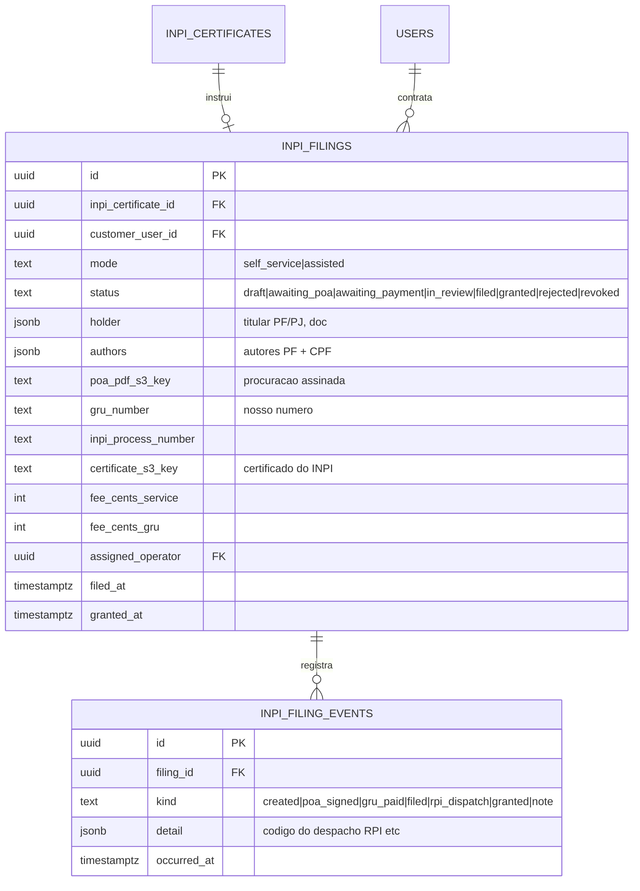
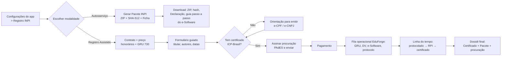

# EDUFORGE — Documento Mestre para Desenvolvimento (PRD Consolidado v2.0)

> **Propósito deste arquivo:** documento único que consolida o PRD v1.0, o Anexo Técnico v1.1 (modelo de dados, Gherkin, estimativas), o Anexo INPI v1.2 e o Anexo de Especificações v1.3 (JSON Schemas, API, wireframes), precedidos de instruções operacionais para o **Claude Code** construir o aplicativo. Este documento é a fonte da verdade; em caso de conflito entre partes, vale a ordem: Parte 0 > Parte 6 > Parte 5 > Parte 2 > Parte 1 > demais.

## Sumário

- **PARTE 0** — Instruções de desenvolvimento para o Claude Code
- **PARTE 1** — PRD do produto (visão, personas, requisitos RF-01 a RF-17, NFRs, roadmap)
- **PARTE 2** — Modelo de dados (diagrama ER e decisões de modelagem)
- **PARTE 3** — User stories com critérios de aceite (Gherkin) — usar como base dos testes
- **PARTE 4** — Estimativas de esforço por fase (referência de planejamento, não de código)
- **PARTE 5** — Registro INPI: RF-16 (pacote de código-fonte + hash) e RF-17 (Registro Assistido)
- **PARTE 6** — Especificações técnicas: JSON Schemas das interações, contrato da API, wireframes

---

# PARTE 0 — Instruções de Desenvolvimento para o Claude Code

## 0.1 Como usar este documento

1. Leia a Parte 0 inteira antes de escrever qualquer código.
2. Ao iniciar cada milestone (0.4), releia os requisitos referenciados nela (Partes 1, 5 e 6) e os cenários Gherkin correspondentes (Parte 3) — **os cenários Gherkin são a especificação executável: converta-os em testes automatizados antes ou junto da implementação da feature**.
3. Não implemente nada das Fases 2 e 3 do roadmap sem que a milestone anterior esteja com o *definition of done* completo. Profundidade antes de largura.
4. Na primeira sessão, crie um arquivo `CLAUDE.md` na raiz do repositório com: resumo da stack (0.2), estrutura de pastas (0.3), comandos de dev/test/lint, convenções (0.6) e o estado atual das milestones (checklist). Mantenha-o atualizado ao final de cada sessão de trabalho — ele é a sua memória entre sessões.
5. Mantenha também um `docs/DECISIONS.md` (ADRs curtos): toda vez que este PRD permitir mais de um caminho e você escolher um, registre a decisão em 3–5 linhas.

## 0.2 Stack fixada (não reabrir estas decisões)

Para eliminar ambiguidade, as escolhas abaixo estão **decididas**. A Parte 1 §9 menciona alternativas (NestJS/Go, workers Python); ignore-as — vale o que está aqui:

| Camada | Decisão |
|---|---|
| Linguagem | **TypeScript estrito em todo o monorepo** (um único runtime simplifica o desenvolvimento) |
| Monorepo | pnpm workspaces + Turborepo |
| Painéis (criador e admin) | **Next.js 14+ (App Router)** — `apps/web` (criador) e `apps/admin` (console admin, app separado) |
| API | **NestJS + Fastify** em `apps/api` — REST conforme contrato da Parte 6.B (a GraphQL interna citada na Parte 1 fica **fora do MVP**; os painéis consomem a mesma REST) |
| Runtime do app publicado | `apps/runtime` — **Vite + React PWA** que hidrata um `manifest.json` estático por app (Parte 2: `app_versions.manifest`) |
| Jobs assíncronos | **BullMQ + Redis** em `apps/worker` (ingestão, geração IA, TTS, pacote INPI) |
| Banco | **PostgreSQL 16 + Prisma** (extensão `pgvector` para embeddings do tutor) |
| Telemetria de aprendizagem | No MVP, tabela `learning_events` particionada no próprio Postgres; abstrair atrás de `AnalyticsStore` para migrar a ClickHouse depois — **não** instalar ClickHouse agora |
| Arquivos | S3 via SDK compatível — **MinIO no docker-compose local** |
| Autenticação | Implementação própria conforme RF-07: Argon2id (`argon2`), JWT de acesso 15 min + refresh token rotativo opaco (hash no banco), TOTP (`otplib`), rate limit no login |
| Extração de documentos | `unpdf`/`pdfjs-dist` para PDF com texto, `mammoth` para DOCX, `epub2` para EPUB; OCR via **interface `OcrProvider`** com implementação `tesseract.js` local (trocável por serviço gerenciado via env) |
| IA (LLM/TTS/imagem) | **Interface `AiProvider`** com duas implementações: `AnthropicProvider` (API Anthropic, modelos via env) e `MockAiProvider` (respostas determinísticas para dev/testes). Toda chamada de IA passa por aqui — nunca chame o SDK direto de um service |
| UI | Tailwind CSS + shadcn/ui; tokens de design por template em `packages/ui` |
| Validação | **Zod** em toda borda (DTOs da API, env vars, payloads de interação — ver 0.5) |
| Testes | Vitest (unidade/integração), Supertest (API), Playwright (E2E dos painéis e do runtime) |
| Infra local | `docker-compose.yml` com Postgres, Redis e MinIO — `pnpm dev` deve subir tudo com um comando |

## 0.3 Estrutura do monorepo

```
eduforge/
├── CLAUDE.md                  # memória de trabalho (0.1.4)
├── docker-compose.yml
├── apps/
│   ├── web/                   # painel do criador (Next.js)
│   ├── admin/                 # admin console (Next.js, deps mínimas)
│   ├── api/                   # NestJS REST /v1 (Parte 6.B)
│   ├── worker/                # BullMQ: ingest, generate, tts, inpi-package
│   └── runtime/               # PWA do app publicado (Vite)
├── packages/
│   ├── db/                    # Prisma schema + migrations + seeds
│   ├── schemas/               # Zod + JSON Schemas das interações (Parte 6.A)
│   ├── ai/                    # AiProvider, prompts, MockAiProvider
│   ├── ui/                    # componentes + tokens dos templates
│   ├── config/                # env parsing (Zod), constantes, feature flags
│   └── testing/               # fixtures, factories, PDFs de exemplo
└── docs/
    ├── PRD.md                 # este documento
    └── DECISIONS.md           # ADRs
```

## 0.4 Milestones e ordem de implementação (definition of done em cada uma)

Implemente **nesta ordem**. DoD comum a todas: testes passando (`pnpm test` e E2E da milestone), lint/typecheck limpos, migrações aplicáveis do zero (`pnpm db:reset` funciona), `CLAUDE.md` atualizado.

**M0 — Fundação.** Monorepo, docker-compose, Prisma com o schema completo da Parte 2 (todas as tabelas desde já — é mais barato que migrar depois), seeds (1 admin, 1 creator, planos free/pro/business, 4 templates, 15 paletas), CI local (`pnpm verify` = lint + typecheck + test). DoD: `pnpm dev` sobe web+admin+api+worker; healthchecks ok.

**M1 — Autenticação e RBAC (RF-07).** Cadastro/login/refresh/logout, verificação de e-mail (mailer com driver console em dev), recuperação de senha, TOTP, bloqueio progressivo, sessões revogáveis, guards de papel. DoD: todos os cenários Gherkin do Épico 5 como testes; admin sem MFA é barrado no `apps/admin`.

**M2 — Projetos e ingestão (RF-01).** Upload via URL pré-assinada (MinIO), fila `ingest` com etapas (extração → estruturação → classificação) e progresso persistido, Mapa de Conteúdo editável (árvore drag-and-drop no web), aprovação. A "estruturação IA" usa `AiProvider` (mock em dev produz árvore plausível de qualquer PDF de teste em `packages/testing`). DoD: Gherkin US-ING-01/02; upload de um PDF real de 150 páginas gera mapa navegável.

**M3 — Interações (RF-02 + Parte 6.A).** Implementar os 9 tipos em `packages/schemas` (Zod espelhando os JSON Schemas, incluindo as **regras semânticas** descritas na Parte 6.A — grafo acíclico do scenario, paridade de gaps do cloze etc.), geração via fila com validação + até 2 retentativas, CRUD e regeneração, débito no `ai_credit_ledger`. DoD: Gherkin US-IA-01; teste de propriedade: nenhum payload inválido persiste.

**M4 — Estúdio e runtime (RF-03, RF-04).** 4 templates como tokens em `packages/ui`, paletas com verificação WCAG AA programática, preview com o conteúdo real, montagem do `manifest.json` imutável, publicação → subdomínio (em dev: `/:slug` no runtime), rollback, modos de acesso, PWA offline básico. DoD: Gherkin US-DSG-01 e US-PUB-01; Lighthouse PWA ≥ 90 no runtime; trocar template não perde conteúdo.

**M5 — Experiência do aprendiz (RF-05).** Conta leve de learner, matrícula, execução dos 9 tipos de interação no runtime com registro em `learning_events`, progresso, XP/streak, SM-2 dos flashcards, certificado PDF com QR. DoD: fluxo E2E Playwright: aprendiz conclui um app seed e recebe certificado verificável.

**M6 — Painéis (RF-08 a RF-15).** Home do criador, wizard 5 passos (wireframes C.1–C.3), analytics resumido (a partir de `learning_events`), configurações; admin: gestão de usuários (suspender, sessões, auditoria), feature flags com rollout %, impersonação com banner e trilha. DoD: Gherkin do Épico 6; toda ação admin gera `audit_logs` append-only (revogar UPDATE/DELETE da tabela via permissão de banco).

**M7 — INPI (RF-16, Parte 5).** Pacote canônico **determinístico** (ordenação lexicográfica, timestamps fixos em `1980-01-01T00:00:00Z` no ZIP — use `archiver` com `date` fixa), SHA-512, `MANIFEST-FILES.txt`, `METADATA.json`, memorial descritivo (via `AiProvider`) e capturas de tela (Playwright headless contra o runtime), Ficha de Registro, Declaração PDF, verificação sob demanda, tela C.4. DoD: **teste de reprodutibilidade no CI: gerar o pacote 2× (workers distintos) e comparar hashes**; Gherkin US-INPI-01.

**M8 — Registro Assistido (RF-17, Parte 5 §3).** Fluxo de contratação, coleta guiada, validação de PDF assinado (verificar presença de assinatura PAdES via `pdf-lib`/parser ASN.1 básico — validação criptográfica completa fica atrás de interface `SignatureValidator`, mock em dev), fila operacional no admin (wireframe C.6), linha do tempo (C.5), eventos `inpi_filing_events`. A integração real com e-Software é **manual pelo operador** — o sistema gerencia o processo, não automatiza o site do INPI. DoD: Gherkin da Parte 5 §3.5.

**M9 — API pública + webhooks (Parte 6.B).** API keys com escopos, rate limit, idempotência, Problem Details, os 9 webhooks com HMAC e retries. DoD: coleção de testes Supertest cobrindo o fluxo B.3 ponta a ponta; OpenAPI 3.1 gerado do código e publicado em `/v1/openapi.json`.

**M10 — Diferenciais Fase 2 (RF-06.x).** Somente após M0–M9: Sensei (RAG com pgvector + citação obrigatória de `source_ref`), TTS/podcast, imagens IA, gamificação completa. DoD: Sensei nunca responde sem citação; avaliação automatizada com 20 perguntas fixture.

## 0.5 Regras de implementação inegociáveis

1. **Validação nas bordas:** toda entrada externa (HTTP, filas, webhooks, arquivos) passa por Zod antes de tocar lógica de negócio. Os schemas de interação da Parte 6.A são a fonte; gere os JSON Schemas publicáveis a partir do Zod (`zod-to-json-schema`) para manter uma fonte única.
2. **Imutabilidade onde o PRD exige:** `app_versions.manifest`, `inpi_certificates`, `audit_logs` e `ai_credit_ledger` não têm UPDATE/DELETE no código nem na permissão do usuário de banco da aplicação.
3. **Multi-tenant por design:** toda query de recurso do criador filtra por dono/organização no repositório (nunca confiar em filtro vindo do cliente). Teste de autorização negativa para cada rota: usuário A não lê recurso de B (403/404).
4. **Créditos como razão contábil:** saldo = SUM(delta); débito e execução do job na mesma transação lógica (débito pendente → confirmação/estorno no fim do job).
5. **Jobs idempotentes e retomáveis:** toda etapa de fila grava progresso; reprocessar não duplica efeitos (chaves naturais/upsert).
6. **Segurança mínima de saída:** sanitizar todo `*_md` renderizado (permitir só o Markdown restrito da Parte 6.A — sem HTML bruto); CSP no runtime; cookies `httpOnly/secure/sameSite`; segredos apenas via env (validada por Zod em `packages/config` — a aplicação **não sobe** com env inválida).
7. **LGPD desde o M1:** endpoints de exportação e exclusão de conta (exclusão = anonimização assíncrona), consentimento registrado no cadastro.
8. **Acessibilidade:** componentes de interação operáveis por teclado e com ARIA correta desde a primeira versão (está no envelope `a11y` dos schemas); respeitar `prefers-reduced-motion` nos efeitos.
9. **Nada de placeholder silencioso:** se algo do PRD for inviável na sessão, marque com `// TODO(prd:RF-xx):` e registre em `CLAUDE.md` — não simplifique silenciosamente um requisito.
10. **Textos da UI em pt-BR** com chaves de i18n desde o início (`next-intl`), mesmo que só pt-BR exista no MVP.

## 0.6 Convenções

Commits convencionais (`feat:`, `fix:`, `test:`, `chore:`) referenciando milestone e requisito (`feat(m3): quiz schema + validação semântica [RF-02]`). Uma feature = código + teste + migração no mesmo commit lógico. Nomes de tabelas/colunas em `snake_case` inglês (como na Parte 2); UI em pt-BR. Erros da API sempre no formato Problem Details da Parte 6.B.5. Cobertura mínima: 80% em `packages/schemas` e nos services de auth, créditos, publicação e INPI (são o coração do negócio).

## 0.7 Variáveis de ambiente (mínimo do MVP)

```
DATABASE_URL, REDIS_URL,
S3_ENDPOINT, S3_ACCESS_KEY, S3_SECRET_KEY, S3_BUCKET_UPLOADS, S3_BUCKET_APPS, S3_BUCKET_WORM,
JWT_SECRET, REFRESH_TOKEN_PEPPER,
AI_PROVIDER=mock|anthropic, ANTHROPIC_API_KEY, AI_MODEL_STRUCTURE, AI_MODEL_INTERACTIONS,
OCR_PROVIDER=tesseract, MAILER=console|smtp, SMTP_URL,
APP_BASE_URL, RUNTIME_BASE_URL, ADMIN_BASE_URL,
INPI_GRU_FEE_CENTS=21000        # parametrizado, nunca hard-coded (Parte 5 §3.8)
```

## 0.8 O que NÃO fazer no MVP

Não implementar: GraphQL, ClickHouse, apps nativos/Capacitor, marketplace de templates, SSO SAML, Batalha de Quiz em tempo real, Modo História, DNA de Aprendizagem, automação do site do e-Software (o protocolo é operado por humano — M8), gateway de pagamento real (abstrair atrás de `PaymentProvider` com mock; integração real é tarefa própria). Não usar ORM diferente de Prisma, não criar microsserviços — é um monorepo modular com 5 apps.

---


# PARTE 1 — PRD do Produto (v1.0 consolidado, RF-01 a RF-17)

| Campo | Valor |
|---|---|
| Produto | EduForge (nome provisório) |
| Versão do documento | 1.0 |
| Data | 05/07/2026 |
| Autor | Engenharia de Produto |
| Status | Rascunho para aprovação |
| Stakeholders | Produto, Engenharia, Design, Conteúdo, Comercial |

---

## 1. Visão Geral

### 1.1 Problema

Criadores de conteúdo educacional (professores, infoprodutores, empresas de treinamento, editoras) possuem vasto acervo em formatos estáticos — ebooks, apostilas em PDF, DOCX e EPUB. Esse material tem baixo engajamento, taxa de conclusão inferior a 15% e nenhuma telemetria de aprendizagem. Converter esse acervo em experiências interativas hoje exige equipes de design instrucional, desenvolvedores e semanas de trabalho por título.

### 1.2 Solução

EduForge é uma plataforma SaaS que ingere ebooks e apostilas e, por meio de um pipeline de IA, gera automaticamente aplicativos web (PWA) e mobile de aprendizagem interativa: módulos navegáveis, quizzes, flashcards, simulações, gamificação e trilhas adaptativas — com total controle visual (templates, paletas, tipografia, imagens) e publicação em um clique.

### 1.3 Proposta de valor

De um PDF a um aplicativo de aprendizagem publicado em menos de 30 minutos, sem escrever código, com qualidade de estúdio de design instrucional.

### 1.4 Objetivos de negócio (12 meses pós-lançamento)

O produto será considerado bem-sucedido se atingir: 10.000 contas ativas, 50.000 apps gerados, taxa de conversão free→paid de 6%, NPS ≥ 55 e tempo médio de geração do primeiro app abaixo de 30 minutos.

---

## 2. Personas

**P1 — Professora Autora (usuário normal).** Marina, 38, professora de biologia com apostilas próprias em PDF. Quer transformar o material em algo que os alunos usem no celular. Baixa fluência técnica; precisa de fluxo guiado e templates prontos.

**P2 — Infoprodutor (usuário normal, plano Pro).** Rafael, 29, vende ebooks de finanças. Quer diferenciar o produto oferecendo "versão app" com a marca dele (white-label), domínio próprio e métricas de engajamento dos compradores.

**P3 — Gestora de T&D corporativo (usuário normal, plano Business).** Cláudia, 45, converte manuais internos em treinamentos com certificado, precisa de SSO, relatórios de conclusão por equipe e conformidade LGPD.

**P4 — Administrador da plataforma (usuário admin).** Time interno EduForge: opera configurações globais, gestão de usuários e planos, moderação de conteúdo, feature flags, monitoramento e billing.

**P5 — Aprendiz (usuário final).** Consome o app gerado. Não é usuário da plataforma EduForge em si, mas suas interações alimentam a telemetria exibida aos criadores.

---

## 3. Escopo

### 3.1 Dentro do escopo (v1)

Ingestão de PDF, EPUB e DOCX; pipeline de IA para estruturação e geração de interações; editor visual com templates, paletas e biblioteca de imagens; publicação como PWA responsiva com subdomínio; sistema de login e perfis; painel do usuário normal; painel administrativo completo; gamificação e telemetria básica de aprendizagem.

### 3.2 Fora do escopo (v1, planejado para versões futuras)

Apps nativos publicados nas lojas (v1 entrega PWA instalável; export nativo via Capacitor na v2); marketplace de templates de terceiros; edição colaborativa em tempo real multi-cursor; tradução automática multilíngue do conteúdo; venda direta dos apps com checkout embutido.

### 3.3 Premissas e restrições

O conteúdo enviado é de titularidade do usuário (aceite de termos obrigatório no upload). O pipeline de IA usa LLMs via API com custos por token — o modelo de planos precisa cobrir esse custo variável. Conformidade com LGPD é requisito de lançamento (mercado inicial: Brasil).

---

## 4. Requisitos Funcionais

### RF-01 — Ingestão e compreensão de conteúdo

O sistema deve aceitar upload de PDF (incluindo escaneado, via OCR), EPUB, DOCX e Markdown, com limite de 200 MB por arquivo. O pipeline de ingestão executa: extração de texto e imagens preservando ordem de leitura; OCR automático quando o PDF não tem camada de texto; detecção da estrutura (capítulos, seções, subseções, boxes, tabelas, fórmulas, legendas); classificação semântica de cada bloco (conceito, definição, exemplo, exercício, resumo); e geração de um "Mapa de Conteúdo" editável — uma árvore que o usuário revisa e ajusta antes de gerar o app. Critério de aceite: um PDF de 150 páginas com sumário deve gerar mapa com precisão de estrutura ≥ 90% e processamento completo em ≤ 4 minutos.

### RF-02 — Motor de transformação pedagógica (IA)

A partir do Mapa de Conteúdo, a IA gera automaticamente, por seção, um conjunto de interações de aprendizagem que o usuário pode aceitar, editar, regenerar ou excluir:

| Interação | Descrição |
|---|---|
| Quiz | Múltipla escolha, V/F, múltiplas respostas, com feedback explicativo gerado do próprio texto |
| Flashcards | Frente/verso a partir de definições e conceitos-chave, com repetição espaçada (algoritmo SM-2) |
| Complete a lacuna | Cloze deletion sobre frases centrais do conteúdo |
| Arrastar e soltar | Ordenação de etapas de processos, pareamento conceito↔definição, categorização |
| Linha do tempo interativa | Gerada quando o conteúdo contém sequência histórica ou processual |
| Hotspots em imagem | Pontos clicáveis sobre diagramas e figuras extraídas do ebook |
| Cenários ramificados | Mini-casos "e se..." com decisões e consequências, para conteúdo aplicado |
| Resumo em áudio | Narração TTS de cada capítulo + versão "podcast" com dois apresentadores IA debatendo o tema |
| Mapa mental navegável | Grafo interativo dos conceitos do capítulo e suas relações |

Cada interação carrega metadados de rastreio (objetivo de aprendizagem, nível de dificuldade estimado, seção de origem). O usuário controla a "densidade de interações" por um slider (leve / equilibrado / intensivo).

### RF-03 — Estúdio de design: templates, paletas e imagens

O Estúdio é o editor visual do app gerado. Requisitos:

**Templates de estilo (mínimo 8 no lançamento):** Moderno (cards, cantos arredondados, sombras suaves), Contemporâneo (editorial, tipografia serifada, muito espaço em branco), Futurista (dark, neon, glassmorphism, gradientes), Minimalista (monocromático, foco no texto), Acadêmico (sóbrio, notas laterais, numeração), Playful/Kids (cores vivas, ilustrações, mascote), Corporativo (grid rígido, área para logotipo e cores da marca) e Retrô/Brutalist (bordas duras, cores saturadas, tipografia display). Cada template define layout de navegação, componentes, micro-interações e sistema tipográfico, e é trocável a qualquer momento sem perda de conteúdo.

**Paletas de cores:** 30+ paletas curadas com verificação automática de contraste WCAG AA; editor de paleta personalizada; extração de paleta a partir do logotipo do usuário ("envie sua marca e o app inteiro se veste com ela"); modo claro/escuro gerado automaticamente para qualquer paleta.

**Tipografia:** pares de fontes curados por template, com fontes do Google Fonts e upload de fonte própria (planos pagos).

**Imagens:** reaproveitamento das imagens extraídas do ebook; biblioteca integrada de banco de imagens livre; geração de imagens por IA no estilo visual do template escolhido (capas de capítulo, ícones, ilustrações de conceitos) mantendo consistência estética entre todas as imagens do app.

**Preview:** visualização simultânea mobile/tablet/desktop em tempo real, com hot-reload a cada alteração.

### RF-04 — Publicação e distribuição

Publicação em um clique como PWA instalável (ícone na tela inicial, funcionamento offline do conteúdo já visitado). Cada app recebe subdomínio `nomedoapp.eduforge.app`; planos pagos permitem domínio próprio com SSL automático. Controle de acesso do app publicado: público, por link secreto, por senha, ou por lista de e-mails convidados (os aprendizes criam conta leve no app). Versionamento: o criador publica novas versões e pode reverter; aprendizes recebem a atualização sem perder progresso.

### RF-05 — Gamificação e progresso do aprendiz

XP por atividade concluída, sequência de dias (streak) com proteção de streak, conquistas/medalhas configuráveis, ranking opcional por app, barra de progresso por capítulo e certificado de conclusão em PDF com QR de verificação de autenticidade. O criador liga/desliga cada mecânica individualmente.

### RF-06 — Recursos inovadores (diferenciais "uau")

**RF-06.1 — Tutor IA embutido ("Sensei").** Cada app gerado inclui um tutor conversacional que responde perguntas usando exclusivamente o conteúdo do ebook (RAG sobre o material), cita a página/seção de origem em cada resposta e recusa perguntas fora do escopo. Modos: "Explique diferente", "Me teste agora" (gera quiz oral na hora) e "Modo socrático" (responde com perguntas que guiam o aprendiz). O criador define a personalidade do tutor (formal, descontraído, motivador) e pode dar-lhe nome e avatar.

**RF-06.2 — DNA de Aprendizagem.** O sistema constrói, por aprendiz, um perfil dinâmico (retenção por tópico, horário de melhor desempenho, tipos de interação com maior acerto) e reordena silenciosamente a revisão espaçada e a dificuldade dos quizzes. O aprendiz vê seu "DNA" como uma visualização radial compartilhável; o criador vê agregados anônimos ("a turma tem fragilidade no capítulo 4").

**RF-06.3 — Modo História (Aventura de Conhecimento).** Com um clique, a IA reestrutura o conteúdo como jornada narrativa: capítulos viram "regiões" de um mapa ilustrado, quizzes viram "desafios de guardião", e a conclusão desbloqueia territórios. Ideal para conteúdo escolar e onboarding corporativo.

**RF-06.4 — Batalha de Quiz em tempo real.** Aprendizes do mesmo app disputam partidas síncronas de perguntas (1x1 ou salas até 30, estilo gameshow), com código de sala para uso do professor em aula ao vivo.

**RF-06.5 — Estúdio de Podcast IA.** Geração de episódios de áudio por capítulo com dois apresentadores sintéticos conversando sobre o conteúdo (diálogo natural, com discordâncias e exemplos), para consumo em trânsito. Player embutido com velocidade variável e transcrição sincronizada.

**RF-06.6 — Modo Foco Neuro-adaptativo.** Leitura com destaque progressivo de frases (RSVP opcional), régua de leitura, fonte para dislexia (OpenDyslexic), redução de estímulos, e pausas ativas sugeridas com micro-revisões de 30 segundos quando o sistema detecta queda de desempenho na sessão.

**RF-06.7 — Efeitos visuais de recompensa.** Biblioteca de micro-interações por template: confete físico ao concluir capítulo, "tinta viva" que preenche a barra de progresso, cartas de flashcard com flip 3D e brilho holográfico ao dominar um conceito, transições parallax entre capítulos e haptics no mobile. Todos respeitam `prefers-reduced-motion`.

**RF-06.8 — Time Capsule.** O aprendiz grava uma nota (texto/áudio) para si mesmo ao concluir o curso; o sistema a entrega por e-mail 30 dias depois junto com um mini-quiz de retenção — reforçando memória de longo prazo e trazendo o usuário de volta ao app.

---

## 5. Autenticação, Perfis e Permissões

### RF-07 — Sistema de login

Cadastro por e-mail/senha com verificação de e-mail; login social (Google, Apple, Microsoft); autenticação multifator opcional por TOTP e obrigatória para admins; magic link como alternativa sem senha; recuperação de senha com token de uso único e expiração de 30 minutos; bloqueio progressivo após tentativas falhas (rate limiting + CAPTCHA a partir da 5ª tentativa); sessões JWT de curta duração com refresh token rotativo e revogação por dispositivo ("sair de todos os dispositivos"); SSO SAML/OIDC no plano Business. Senhas com Argon2id, política mínima de 10 caracteres com verificação contra listas de senhas vazadas.

### Papéis (RBAC)

| Papel | Descrição |
|---|---|
| `learner` | Usuário final dos apps publicados (conta leve, escopo restrito ao app) |
| `creator` | Usuário normal da plataforma: cria, edita e publica seus apps |
| `org_admin` | Administra uma organização (plano Business): membros, marca, relatórios |
| `support` | Equipe EduForge com acesso leitura + ações de suporte limitadas |
| `admin` | Administrador da plataforma: acesso total ao painel administrativo |
| `super_admin` | Gestão de outros admins, configurações críticas e chaves; requer MFA físico |

---

## 6. Painel do Usuário Normal (Creator Dashboard)

### RF-08 — Visão geral

Home com cards dos apps criados (miniatura ao vivo, status: rascunho/publicado/atualização pendente), atalho "Novo app a partir de arquivo", consumo do plano (apps, armazenamento, créditos de IA) e feed de destaques ("seu app X teve 214 sessões esta semana").

### RF-09 — Fluxo de criação guiado

Wizard de 5 passos: (1) upload do arquivo → (2) revisão do Mapa de Conteúdo → (3) escolha de template e paleta (com prévia gerada usando o conteúdo real do usuário, não lorem ipsum) → (4) seleção de interações e densidade → (5) revisão e publicação. Todo passo salva rascunho automaticamente.

### RF-10 — Analytics de aprendizagem

Por app: sessões, usuários ativos, taxa de conclusão por capítulo, funil de abandono, mapa de calor de dificuldade (questões com mais erro), tempo médio por seção, desempenho do tutor IA (perguntas mais feitas — insumo valioso para o autor melhorar o material) e exportação CSV. Plano Business adiciona relatórios por equipe e agendamento de relatórios por e-mail.

### RF-11 — Configurações do criador

Perfil (nome, avatar, idioma, fuso), segurança (senha, MFA, sessões ativas), marca (logotipo, cores padrão, domínio próprio), integrações (webhooks de eventos de aprendizagem, exportação xAPI/SCORM no Business), plano e faturamento (upgrade, notas fiscais, histórico), e privacidade (exportar meus dados, excluir conta — LGPD).

---

## 7. Painel Administrativo (Admin Console)

Aplicação separada em `admin.eduforge.app`, acessível apenas a `admin`/`super_admin`/`support`, com MFA obrigatório, allowlist opcional de IP e trilha de auditoria imutável de toda ação.

### RF-12 — Gestão de usuários e organizações

Busca e filtro de contas; visualização 360º do usuário (apps, consumo, pagamentos, tickets, logs de acesso); ações: suspender, reativar, forçar redefinição de senha, encerrar sessões, ajustar limites, conceder créditos, impersonar usuário para suporte (com banner visível, consentimento registrado e gravação da sessão na auditoria); gestão de papéis e convites de novos admins (apenas `super_admin`); LGPD: atender requisições de exportação e exclusão definitiva com fila de anonimização.

### RF-13 — Configuração de ambiente e plataforma

Feature flags por usuário, plano, organização ou percentual de rollout; parâmetros do pipeline de IA (modelos utilizados, temperatura, limites de tokens, provedores de fallback, custo-alvo por geração); gestão do catálogo de templates, paletas e fontes (publicar, despublicar, agendar lançamentos sazonais); limites por plano (nº de apps, MB de upload, créditos de IA, domínios); textos e banners do sistema (avisos de manutenção, changelog in-app); e configuração de e-mails transacionais (templates, remetente, idiomas).

### RF-14 — Moderação e conformidade

Fila de revisão de conteúdo sinalizado (automático por classificador + denúncias de usuários); ações de despublicar app com notificação fundamentada; gestão de reclamações de direitos autorais (fluxo de notificação e contranotificação); painel LGPD com registro de bases legais e relatórios de incidentes.

### RF-15 — Operação, billing e observabilidade

Dashboard de saúde (fila de processamento de ebooks, latência do pipeline, taxa de erro por etapa, custo de IA por hora); gestão de planos e preços (criar planos, cupons, trials estendidos); reconciliação de pagamentos e inadimplência (integração com gateway); métricas de negócio (MRR, churn, ativação, conversão free→paid) e exportação para o data warehouse.

### RF-16 — Pacote de Código-Fonte e Hash para registro no INPI

Como os apps ficam hospedados nos servidores da plataforma, o criador pode gerar, por versão publicada, um **ZIP canônico determinístico com o código-fonte do aplicativo e a documentação técnica** (manifesto, interações, tema, trechos do runtime licenciado, capturas de telas, memorial descritivo e ativos), com resumo hash **SHA-512** — o formato e o algoritmo alinhados ao que o sistema e-Software do INPI espera. Acompanham: Ficha de Registro pré-preenchida (título, datas, linguagens, campo de aplicação, derivação autorizada), Declaração de Integridade em PDF e carimbo de tempo RFC 3161 opcional. O pacote é congelado em WORM por 50 anos e sempre disponibilizado para download, pois a guarda legal é do titular. Especificação completa no Anexo INPI v1.2.

### RF-17 — Registro Assistido no INPI (consultoria)

Serviço pago em que a EduForge atua como **procuradora** do titular e executa o registro de ponta a ponta: coleta guiada de dados, geração da procuração para assinatura digital qualificada ICP-Brasil do cliente, emissão e pagamento da GRU (código 730), assinatura da DV pelo procurador, preenchimento e protocolo do e-Software, monitoramento da RPI e entrega do Certificado de Registro no painel. Fluxo, regras de compliance, Gherkin e modelo de dados no Anexo INPI v1.2.

---

## 8. Requisitos Não Funcionais

| Categoria | Requisito |
|---|---|
| Desempenho | Apps publicados com LCP < 2,5 s em 4G; TTI do painel < 3 s; pipeline de ingestão paralelo por capítulo |
| Escalabilidade | Processamento assíncrono por filas; workers de IA com autoscaling; meta de 1.000 gerações simultâneas |
| Disponibilidade | SLO 99,9% para apps publicados (servidos por CDN, independentes do painel) |
| Segurança | OWASP ASVS nível 2; criptografia em repouso e em trânsito; segregação de conteúdo por tenant; pentest antes do GA |
| Privacidade | LGPD by design: minimização, consentimento granular, retenção configurável, DPO nomeado |
| Acessibilidade | WCAG 2.2 AA em todos os templates; auditoria automática de contraste no Estúdio |
| i18n | Interface em pt-BR, en e es no lançamento; apps gerados herdam o idioma do conteúdo |
| Compatibilidade | Últimas 2 versões de Chrome, Safari, Firefox, Edge; Android 10+ e iOS 15+ para PWA |

---

## 9. Arquitetura de Referência

**Frontend:** Next.js (painéis) e runtime de app publicado como PWA estática hidratada por manifesto JSON do app (conteúdo + tema + interações), servida via CDN. **Backend:** API em Node.js/NestJS ou Go, GraphQL para os painéis e REST para o runtime dos apps. **Pipeline de IA:** orquestração por filas (SQS/RabbitMQ) com workers Python; etapas: extração (PyMuPDF/pandoc + OCR Tesseract/serviço gerenciado) → estruturação (LLM) → geração de interações (LLM com validação de schema) → geração de mídia (TTS e imagens) → montagem do manifesto. **Dados:** PostgreSQL (núcleo), Redis (sessões/filas leves), S3 (arquivos e manifestos), pgvector para o RAG do tutor, ClickHouse para telemetria de aprendizagem. **Infra:** containers em Kubernetes ou ECS, IaC com Terraform, observabilidade com OpenTelemetry + Grafana, CI/CD com deploy canário.

**Modelo de dados (núcleo):** `users`, `organizations`, `memberships(role)`, `projects` (um por ebook), `source_files`, `content_maps`, `app_versions` (manifesto imutável por publicação), `interactions`, `themes`, `learners`, `enrollments`, `learning_events` (telemetria), `subscriptions`, `audit_logs`, `feature_flags`.

---

## 10. Métricas de Sucesso (KPIs)

Ativação: % de contas que publicam o 1º app em 7 dias (meta ≥ 40%). Tempo mediano upload→publicação (meta ≤ 30 min). Qualidade da IA: % de interações geradas aceitas sem edição (meta ≥ 70%). Engajamento do aprendiz: taxa de conclusão média dos apps (meta ≥ 45%, vs. ~15% de ebooks). Retenção do criador: apps ativos por conta no mês 3. Negócio: conversão free→paid ≥ 6%, churn mensal < 4%.

---

## 11. Roadmap por Fases

**Fase 1 — MVP (meses 1–4):** ingestão PDF/EPUB/DOCX, mapa de conteúdo, quizzes + flashcards + lacunas, 4 templates, 15 paletas, publicação PWA com subdomínio, login completo, painel do criador básico, admin com gestão de usuários e feature flags.

**Fase 2 — Diferenciação (meses 5–8):** Tutor IA "Sensei", podcast IA, arrastar-e-soltar, hotspots, linha do tempo, 8 templates, geração de imagens por IA, domínio próprio, analytics completo, gamificação, certificação hash INPI (RF-16), Registro Assistido INPI (RF-17), admin de moderação e billing.

**Fase 3 — Expansão (meses 9–12):** Modo História, Batalha de Quiz, DNA de Aprendizagem, Time Capsule, SSO/SCORM/xAPI Business, export nativo (Capacitor) para lojas, marketplace de templates (beta).

---

## 12. Riscos e Mitigações

| Risco | Impacto | Mitigação |
|---|---|---|
| Qualidade irregular da extração em PDFs complexos | Alto | Etapa obrigatória de revisão do Mapa de Conteúdo; métricas de confiança por bloco; melhoria contínua com feedback |
| Custo de IA por geração acima do previsto | Alto | Créditos por plano, cache de gerações, modelos escalonados por tarefa, orçamento por job no admin |
| Upload de conteúdo protegido por direitos autorais | Alto | Aceite de titularidade, detecção de obras conhecidas, fluxo de takedown no admin |
| Alucinação do tutor IA | Médio | RAG estrito com citação obrigatória, recusa fora do escopo, avaliação automatizada contínua |
| Dependência de um único provedor de LLM | Médio | Camada de abstração com fallback multi-provedor |

---

## 13. Questões em Aberto

Precificação exata dos créditos de IA por plano; nome definitivo do produto e do tutor; estratégia de lojas de apps (conta única EduForge vs. conta do cliente) na v2; profundidade do suporte a fórmulas matemáticas (LaTeX) no MVP.


---

# PARTE 2 — Modelo de Dados

## A. Modelo de Dados — Diagrama ER

### A.1 Diagrama (Mermaid)

```mermaid
erDiagram
    USERS ||--o{ MEMBERSHIPS : possui
    ORGANIZATIONS ||--o{ MEMBERSHIPS : agrega
    USERS ||--o{ PROJECTS : cria
    ORGANIZATIONS ||--o{ PROJECTS : "é dona de"
    PROJECTS ||--o{ SOURCE_FILES : recebe
    PROJECTS ||--|| CONTENT_MAPS : "estrutura em"
    CONTENT_MAPS ||--o{ CONTENT_BLOCKS : contém
    PROJECTS ||--o{ APP_VERSIONS : publica
    APP_VERSIONS ||--o{ INTERACTIONS : inclui
    CONTENT_BLOCKS ||--o{ INTERACTIONS : origina
    APP_VERSIONS }o--|| THEMES : usa
    THEMES }o--|| TEMPLATES : "deriva de"
    APP_VERSIONS ||--o{ MEDIA_ASSETS : referencia
    APP_VERSIONS ||--o| INPI_CERTIFICATES : "certificada por"
    PROJECTS ||--o{ ENROLLMENTS : matricula
    LEARNERS ||--o{ ENROLLMENTS : participa
    ENROLLMENTS ||--o{ LEARNING_EVENTS : gera
    ENROLLMENTS ||--o{ LEARNER_PROGRESS : acumula
    ENROLLMENTS ||--o| CERTIFICATES : conquista
    LEARNERS ||--o| LEARNING_DNA : desenvolve
    USERS ||--o{ SUBSCRIPTIONS : contrata
    SUBSCRIPTIONS }o--|| PLANS : segue
    SUBSCRIPTIONS ||--o{ INVOICES : fatura
    USERS ||--o{ AI_CREDIT_LEDGER : consome
    USERS ||--o{ SESSIONS : autentica
    USERS ||--o{ AUDIT_LOGS : registra
    PROJECTS ||--o{ MODERATION_CASES : "sujeito a"
    FEATURE_FLAGS ||--o{ FLAG_ASSIGNMENTS : segmenta

    USERS {
        uuid id PK
        citext email UK
        text password_hash "Argon2id, null se só social"
        text name
        text locale
        text role "creator|support|admin|super_admin"
        jsonb mfa "tipo, secret cifrado, backup codes"
        text status "active|suspended|pending_deletion"
        timestamptz created_at
    }
    ORGANIZATIONS {
        uuid id PK
        text name
        text slug UK
        jsonb branding "logo, cores, dominio"
        jsonb sso_config "SAML/OIDC cifrado"
        timestamptz created_at
    }
    MEMBERSHIPS {
        uuid id PK
        uuid user_id FK
        uuid org_id FK
        text org_role "org_admin|editor|viewer"
    }
    PROJECTS {
        uuid id PK
        uuid owner_user_id FK
        uuid org_id FK "nullable"
        text title
        text slug UK "subdominio"
        text custom_domain "nullable, UK"
        text status "draft|published|unpublished|blocked"
        text access_mode "public|link|password|invite"
        timestamptz created_at
    }
    SOURCE_FILES {
        uuid id PK
        uuid project_id FK
        text s3_key
        text mime "pdf|epub|docx|md"
        bigint size_bytes
        text sha256 "integridade do original"
        text ocr_status
        jsonb extraction_report "confiança por etapa"
    }
    CONTENT_MAPS {
        uuid id PK
        uuid project_id FK
        int revision
        jsonb tree "capitulos/secoes ordenados"
        float structure_confidence
        timestamptz approved_at "aceite do usuario"
    }
    CONTENT_BLOCKS {
        uuid id PK
        uuid content_map_id FK
        uuid parent_id FK "hierarquia"
        int position
        text kind "concept|definition|example|exercise|summary|figure|table|formula"
        text content_md
        jsonb source_ref "pagina/offset no arquivo original"
        vector embedding "pgvector p/ RAG do tutor"
    }
    APP_VERSIONS {
        uuid id PK
        uuid project_id FK
        int version_number
        uuid theme_id FK
        jsonb manifest "IMUTAVEL apos publicacao"
        text manifest_s3_key
        text bundle_sha512 "hash do pacote canonico"
        text status "building|published|rolled_back"
        timestamptz published_at
    }
    INTERACTIONS {
        uuid id PK
        uuid app_version_id FK
        uuid content_block_id FK
        text type "quiz|flashcard|cloze|dragdrop|timeline|hotspot|scenario|audio|mindmap"
        jsonb payload "validado por JSON Schema por tipo"
        text difficulty "easy|medium|hard"
        text origin "ai_generated|ai_edited|manual"
        int position
    }
    TEMPLATES {
        uuid id PK
        text key UK "modern|futurist|..."
        text name
        jsonb tokens "layout, tipografia, motion"
        bool published
        int min_plan_tier
    }
    THEMES {
        uuid id PK
        uuid template_id FK
        uuid project_id FK
        jsonb palette "cores + dark mode"
        jsonb typography
        jsonb effects "confete, parallax, haptics on/off"
    }
    MEDIA_ASSETS {
        uuid id PK
        uuid project_id FK
        text s3_key
        text kind "extracted|stock|ai_generated|upload|tts|podcast"
        text sha256
        jsonb meta "alt, licenca, prompt de geracao"
    }
    LEARNERS {
        uuid id PK
        citext email UK
        text name
        text password_hash "conta leve"
        timestamptz created_at
    }
    ENROLLMENTS {
        uuid id PK
        uuid learner_id FK
        uuid project_id FK
        int pinned_version "versao em uso"
        timestamptz enrolled_at
    }
    LEARNING_EVENTS {
        uuid id PK "ClickHouse, particionado por dia"
        uuid enrollment_id FK
        uuid interaction_id FK "nullable"
        text event "view|answer|complete|streak|battle|tutor_question"
        jsonb detail "resposta, acerto, tempo_ms"
        timestamptz occurred_at
    }
    LEARNER_PROGRESS {
        uuid enrollment_id FK
        uuid content_block_id FK
        float mastery "0..1"
        int xp
        int streak_days
        timestamptz next_review_at "SM-2"
    }
    LEARNING_DNA {
        uuid learner_id PK
        jsonb profile "retencao por topico, horarios, tipos"
        timestamptz updated_at
    }
    CERTIFICATES {
        uuid id PK
        uuid enrollment_id FK
        text verify_code UK "QR publico"
        text pdf_s3_key
        timestamptz issued_at
    }
    INPI_CERTIFICATES {
        uuid id PK
        uuid app_version_id FK
        text algorithm "SHA-512"
        text bundle_hash UK
        text manifest_canonical_s3_key "ZIP deterministico congelado"
        text declaration_pdf_s3_key
        text tsa_token_s3_key "carimbo de tempo RFC 3161, opcional"
        uuid requested_by FK
        timestamptz generated_at
    }
    PLANS {
        uuid id PK
        text key UK "free|pro|business"
        jsonb limits "apps, MB, creditos IA, dominios"
        int price_cents_month
    }
    SUBSCRIPTIONS {
        uuid id PK
        uuid user_id FK
        uuid plan_id FK
        text status "trialing|active|past_due|canceled"
        text gateway_ref
        timestamptz current_period_end
    }
    INVOICES {
        uuid id PK
        uuid subscription_id FK
        int amount_cents
        text status
        text nfe_key "nota fiscal"
    }
    AI_CREDIT_LEDGER {
        uuid id PK
        uuid user_id FK
        int delta "negativo = consumo"
        text reason "ingest|interactions|image|tts|tutor"
        uuid ref_id "job relacionado"
        timestamptz created_at
    }
    SESSIONS {
        uuid id PK
        uuid user_id FK
        text refresh_token_hash
        jsonb device "ip, user_agent"
        timestamptz expires_at
        timestamptz revoked_at
    }
    AUDIT_LOGS {
        uuid id PK "append-only, WORM"
        uuid actor_id FK
        text actor_role
        text action
        text target_type
        uuid target_id
        jsonb before_after
        timestamptz created_at
    }
    MODERATION_CASES {
        uuid id PK
        uuid project_id FK
        text source "classifier|report|dmca"
        text status "open|reviewing|resolved|takedown"
        uuid assignee_id FK
        jsonb evidence
    }
    FEATURE_FLAGS {
        uuid id PK
        text key UK
        bool default_on
        int rollout_pct
    }
    FLAG_ASSIGNMENTS {
        uuid id PK
        uuid flag_id FK
        text subject_type "user|org|plan"
        uuid subject_id
        bool enabled
    }
```



### A.2 Decisões de modelagem

**Imutabilidade de `APP_VERSIONS`.** O campo `manifest` é congelado na publicação; qualquer edição gera nova versão. Isso viabiliza rollback instantâneo, preserva o progresso dos aprendizes (que apontam para `pinned_version`) e é pré-condição para o hash INPI ser verificável no futuro (RF-16): o pacote que gerou o hash existe para sempre, byte a byte.

**Separação `USERS` × `LEARNERS`.** Aprendizes são contas leves, escopadas ao app, com LGPD independente (o criador é o controlador dos dados de seus aprendizes; a EduForge, operadora). Evita que milhões de aprendizes inflem a tabela de contas da plataforma.

**Telemetria fora do OLTP.** `LEARNING_EVENTS` vive no ClickHouse (alto volume, escrita append-only, agregações analíticas); PostgreSQL mantém apenas o estado consolidado (`LEARNER_PROGRESS`).

**`AI_CREDIT_LEDGER` como razão contábil.** Créditos de IA nunca são um contador mutável: cada consumo/concessão é uma linha imutável, o saldo é a soma. Elimina condições de corrida e dá trilha de auditoria de custo por job.

**`AUDIT_LOGS` em WORM.** Escrita única (S3 Object Lock ou partição append-only), exigência do Admin Console e da certificação INPI.

---


---

# PARTE 3 — User Stories com Critérios de Aceite (Gherkin)

> Converter cada cenário em teste automatizado (ver Parte 0, §0.1 e §0.4).

## B. User Stories com Critérios de Aceite (Gherkin)

Convenção: `US-<épico>-<nº>`. Idioma Gherkin: `# language: pt`.

### Épico 1 — Ingestão e Mapa de Conteúdo

**US-ING-01 — Upload e processamento de ebook**
Como criadora, quero enviar minha apostila em PDF para que o sistema a estruture automaticamente.

```gherkin
# language: pt
Funcionalidade: Upload e ingestão de ebook

  Contexto:
    Dado que estou autenticada como "creator" no plano "Pro"
    E estou na tela "Novo app"

  Cenário: PDF com camada de texto é processado com sucesso
    Quando envio o arquivo "biologia.pdf" de 42 MB com sumário
    Então vejo a barra de progresso com as etapas "Extraindo", "Estruturando" e "Classificando"
    E em até 4 minutos vejo o Mapa de Conteúdo com capítulos e seções
    E cada seção exibe um indicador de confiança da extração
    E o arquivo original tem seu SHA-256 registrado em "source_files"

  Cenário: PDF escaneado dispara OCR automaticamente
    Quando envio um PDF sem camada de texto
    Então o sistema informa "Documento escaneado detectado — aplicando OCR"
    E o processamento continua sem ação adicional minha

  Cenário: Arquivo acima do limite é rejeitado
    Quando envio um arquivo de 250 MB
    Então vejo a mensagem "Limite de 200 MB por arquivo"
    E nenhum job de ingestão é criado

  Cenário: Formato não suportado
    Quando envio um arquivo ".pages"
    Então vejo os formatos aceitos "PDF, EPUB, DOCX, Markdown"
```

**US-ING-02 — Revisão do Mapa de Conteúdo**

```gherkin
# language: pt
Funcionalidade: Revisão e aprovação do Mapa de Conteúdo

  Cenário: Reorganizar seções antes de gerar o app
    Dado que o Mapa de Conteúdo do projeto "Biologia" foi gerado
    Quando arrasto a seção "Mitose" para dentro do capítulo "Divisão Celular"
    E renomeio o capítulo 3 para "Genética Básica"
    E clico em "Aprovar mapa"
    Então uma nova revisão do mapa é salva com "approved_at" preenchido
    E o botão "Gerar interações" é habilitado

  Cenário: Bloco com baixa confiança é destacado
    Dado que um bloco tem confiança de extração menor que 0.7
    Então ele aparece com destaque âmbar e a ação "Revisar texto"
```

### Épico 2 — Geração de Interações (IA)

**US-IA-01 — Gerar e curar interações**

```gherkin
# language: pt
Funcionalidade: Geração de interações de aprendizagem

  Cenário: Geração com densidade "equilibrado"
    Dado que o mapa do projeto "Biologia" está aprovado
    E o slider de densidade está em "equilibrado"
    Quando clico em "Gerar interações"
    Então cada seção recebe entre 2 e 4 interações de tipos variados
    E cada quiz possui feedback explicativo citando a seção de origem
    E cada interação exibe as ações "Aceitar", "Editar", "Regenerar" e "Excluir"
    E o consumo é debitado no razão de créditos de IA com motivo "interactions"

  Cenário: Regenerar uma interação específica
    Quando clico em "Regenerar" no quiz da seção "Fotossíntese"
    Então apenas essa interação é substituída
    E o campo "origin" da nova interação é "ai_generated"

  Cenário: Payload inválido nunca chega ao app
    Dado que o modelo retornou um quiz sem alternativa correta marcada
    Então o validador de schema rejeita o payload
    E uma nova tentativa é feita automaticamente até 2 vezes
    E, persistindo a falha, a seção é marcada "geração pendente" sem quebrar o fluxo

  Cenário: Créditos insuficientes
    Dado que meu saldo de créditos de IA é 0
    Quando clico em "Gerar interações"
    Então vejo a opção de comprar créditos ou mudar de plano
    E nenhum job é enfileirado
```

### Épico 3 — Estúdio de Design

**US-DSG-01 — Template e paleta**

```gherkin
# language: pt
Funcionalidade: Personalização visual do app

  Cenário: Trocar template preservando conteúdo
    Dado que meu app usa o template "Moderno"
    Quando seleciono o template "Futurista"
    Então o preview é atualizado em menos de 2 segundos com meu conteúdo real
    E nenhuma interação ou texto é perdido

  Cenário: Paleta extraída do logotipo
    Quando envio o logotipo "marca.png" na aba "Marca"
    Então o sistema propõe uma paleta derivada das cores dominantes
    E todas as combinações texto/fundo passam na verificação WCAG AA
    E combinações reprovadas são ajustadas automaticamente com aviso

  Cenário: Modo escuro automático
    Quando ativo "Gerar modo escuro"
    Então o preview alterna entre claro e escuro mantendo contraste AA
```

### Épico 4 — Publicação

**US-PUB-01 — Publicar e versionar**

```gherkin
# language: pt
Funcionalidade: Publicação do aplicativo

  Cenário: Primeira publicação com subdomínio
    Dado que meu projeto "biologia-viva" está pronto
    Quando clico em "Publicar" e confirmo
    Então a versão 1 é criada com manifesto imutável
    E o app fica acessível em "biologia-viva.eduforge.app" em até 60 segundos
    E o hash SHA-512 do pacote canônico é registrado em "app_versions.bundle_sha512"

  Cenário: Rollback de versão
    Dado que a versão 3 está publicada e apresenta um problema
    Quando aciono "Reverter para versão 2"
    Então a versão 2 volta a ser servida em até 60 segundos
    E o progresso dos aprendizes é preservado

  Cenário: App protegido por senha
    Dado que o modo de acesso é "password"
    Quando um visitante acessa o app sem informar a senha
    Então nenhum conteúdo do manifesto é entregue ao navegador
```

### Épico 5 — Autenticação

**US-AUTH-01 — Login e MFA**

```gherkin
# language: pt
Funcionalidade: Autenticação de usuários

  Cenário: Login com MFA habilitado
    Dado que tenho MFA TOTP ativo
    Quando informo e-mail e senha corretos
    Então sou direcionado à etapa de código TOTP
    E ao informar o código válido recebo sessão com refresh token rotativo

  Cenário: Bloqueio progressivo
    Quando erro a senha 5 vezes em 10 minutos
    Então um CAPTCHA é exigido nas próximas tentativas
    E a 10ª falha bloqueia novas tentativas por 15 minutos

  Cenário: Encerrar sessões remotas
    Dado que estou logado em 3 dispositivos
    Quando aciono "Sair de todos os dispositivos"
    Então todos os refresh tokens são revogados
    E os outros dispositivos exigem novo login em até 60 segundos

  Cenário: Admin sem MFA é barrado no console
    Dado que sou "admin" sem MFA configurado
    Quando acesso "admin.eduforge.app"
    Então sou forçado a configurar MFA antes de qualquer outra ação
```

### Épico 6 — Painel Administrativo

**US-ADM-01 — Gestão de usuários e impersonação**

```gherkin
# language: pt
Funcionalidade: Administração de contas

  Cenário: Suspender usuário com trilha de auditoria
    Dado que estou autenticado como "admin" com MFA
    Quando suspendo o usuário "rafael@exemplo.com" com o motivo "chargeback"
    Então o status do usuário muda para "suspended"
    E todas as sessões dele são revogadas
    E os apps dele permanecem publicados conforme a política do plano
    E um registro imutável é gravado em "audit_logs" com antes/depois

  Cenário: Impersonar para suporte
    Quando inicio impersonação do usuário "marina@exemplo.com"
    Então vejo o painel dela com um banner permanente "Sessão de suporte"
    E ações de pagamento e exclusão de conta ficam bloqueadas
    E a sessão de impersonação inteira é registrada na auditoria

  Cenário: Feature flag com rollout parcial
    Quando ativo a flag "modo_historia" com rollout de 10%
    Então aproximadamente 10% dos criadores veem o recurso
    E posso fixar "enabled=true" para um usuário específico de teste
```

### Épico 7 — Certificação INPI (RF-16)

**US-INPI-01 — Gerar hash para registro de programa de computador**

```gherkin
# language: pt
Funcionalidade: Certificação hash do aplicativo para registro no INPI

  Contexto:
    Dado que estou autenticada como "creator" no plano "Pro" ou superior
    E o projeto "biologia-viva" possui a versão 3 publicada

  Cenário: Gerar pacote canônico e hash SHA-512
    Quando acesso "Configurações do app > Registro INPI" e clico em "Gerar certificação"
    Então o sistema monta o pacote canônico determinístico da versão 3
    E calcula o resumo hash com o algoritmo "SHA-512"
    E exibe o hash completo com botão de copiar
    E disponibiliza para download o ZIP canônico e a "Declaração de Integridade" em PDF
    E o registro é gravado em "inpi_certificates" vinculado à versão 3

  Cenário: Reprodutibilidade do hash
    Dado que já gerei a certificação da versão 3
    Quando clico em "Verificar integridade" 6 meses depois
    Então o sistema recalcula o hash do pacote congelado
    E o resultado é idêntico ao hash registrado
    E vejo o selo "Íntegro — verificado em <data>"

  Cenário: Nova versão exige nova certificação
    Dado que publiquei a versão 4 do app
    Quando acesso "Registro INPI"
    Então vejo que a certificação existente refere-se à versão 3
    E sou orientada de que alterações no app registrado podem exigir novo registro (registro derivado) no INPI

  Cenário: Carimbo de tempo opcional
    Quando marco a opção "Incluir carimbo de tempo (RFC 3161)"
    Então o hash é submetido a uma Autoridade de Carimbo de Tempo credenciada
    E o token .tst é anexado ao pacote de certificação

  Cenário: Aviso de responsabilidade
    Quando abro a tela "Registro INPI" pela primeira vez
    Então vejo o aviso de que a EduForge gera o resumo hash e a documentação técnica
    E que o pedido de registro no sistema e-Software do INPI, o pagamento da GRU e a titularidade são de responsabilidade do usuário
```

---


---

# PARTE 4 — Estimativas de Esforço (referência de planejamento)

> Informativo para priorização humana; o Claude Code deve seguir as milestones da Parte 0 §0.4, não estas fases.

## C. Estimativa de Esforço por Fase

### C.1 Premissas

Estimativas em **pessoa-semanas (PS)** de desenvolvimento, já incluindo testes automatizados e code review; excluem descoberta de produto e design visual (time paralelo). Sprint de 2 semanas. Buffer de risco de 20% aplicado sobre o subtotal de cada fase (integrações de IA e extração de documentos têm incerteza alta). Velocidade assumida: 1 dev sênior ≈ 1 PS/semana efetiva (considerando reuniões e suporte).

**Time proposto:** 1 Tech Lead, 3 devs backend, 3 devs frontend, 2 engenheiros de IA/ML, 1 DevOps/SRE, 1 QA — 11 pessoas ≈ 10 PS/semana de capacidade efetiva.

### C.2 Fase 1 — MVP (meta: 4 meses)

| Épico | Escopo resumido | PS |
|---|---|---:|
| Fundação e infra | Monorepo, CI/CD, IaC, ambientes, observabilidade, filas | 14 |
| Autenticação e RBAC | E-mail/senha, social, MFA, sessões, recuperação, papéis | 12 |
| Pipeline de ingestão | Extração PDF/EPUB/DOCX, OCR, estruturação IA, Mapa de Conteúdo | 26 |
| Geração de interações v1 | Quiz, flashcards (SM-2), lacunas; validação de schema; regeneração | 20 |
| Estúdio de design v1 | 4 templates, 15 paletas, tipografia, preview multi-device | 22 |
| Runtime PWA + publicação | Manifesto, CDN, subdomínios, offline, versionamento/rollback | 18 |
| Painel do criador v1 | Home, wizard 5 passos, configurações, consumo do plano | 14 |
| Admin Console v1 | Gestão de usuários, auditoria, feature flags, saúde do pipeline | 14 |
| Billing v1 | Planos, gateway, razão de créditos de IA | 10 |
| QA/hardening/beta | Testes E2E, pentest inicial, correções de beta fechado | 12 |
| **Subtotal** | | **162** |
| **Total com buffer 20%** | | **~194 PS ≈ 19–20 semanas** |

Com 10 PS/semana, a Fase 1 fecha em **~5 meses corridos** — 1 mês acima da meta original de 4. Recomendação: mover Admin Console além de usuários+flags e o login social Apple/Microsoft para o início da Fase 2, trazendo o MVP de volta para ~4,5 meses.

### C.3 Fase 2 — Diferenciação (meta: 4 meses)

| Épico | Escopo resumido | PS |
|---|---|---:|
| Tutor IA "Sensei" | RAG com citação, modos de conversa, guarda-trilhos, avaliação | 20 |
| Estúdio de Podcast IA + TTS | Roteirização por LLM, síntese multi-voz, player com transcrição | 14 |
| Interações avançadas | Drag&drop, hotspots, linha do tempo, cenários ramificados | 18 |
| Templates 5–8 + imagens IA | 4 novos templates, geração de imagem estilo-consistente | 16 |
| **RF-16 Certificação INPI** | Pacote canônico, SHA-512, declaração PDF, TSA RFC 3161, verificação | 6 |
| Domínio próprio + SSL | Provisionamento automático, validação DNS | 6 |
| Analytics completo | Funis, mapa de calor, ClickHouse, exportações | 14 |
| Gamificação | XP, streaks, conquistas, ranking, certificados de conclusão | 12 |
| Admin: moderação + billing | Filas de moderação, takedown, cupons, reconciliação | 12 |
| QA/hardening | | 8 |
| **Subtotal** | | **126** |
| **Total com buffer 20%** | | **~151 PS ≈ 15 semanas ≈ 3,5–4 meses** ✅ |

### C.4 Fase 3 — Expansão (meta: 4 meses)

| Épico | Escopo resumido | PS |
|---|---|---:|
| Modo História | Reestruturação narrativa, mapa ilustrado, desafios | 18 |
| Batalha de Quiz (tempo real) | WebSockets, salas, matchmaking, modo professor | 16 |
| DNA de Aprendizagem | Modelagem, jobs de perfil, visualização radial, agregados | 14 |
| Time Capsule | Agendamento, e-mail, mini-quiz de retenção | 5 |
| Business: SSO + SCORM/xAPI | SAML/OIDC, exportadores, relatórios por equipe | 16 |
| Export nativo (Capacitor) | Empacotamento Android/iOS, guia de publicação | 14 |
| Marketplace de templates (beta) | Submissão, revisão, revenue share | 12 |
| QA/hardening | | 8 |
| **Subtotal** | | **103** |
| **Total com buffer 20%** | | **~124 PS ≈ 12–13 semanas ≈ 3–3,5 meses** ✅ |

### C.5 Resumo

| Fase | PS c/ buffer | Duração estimada | Custo aprox.* |
|---|---:|---|---:|
| Fase 1 — MVP | 194 | 4,5–5 meses | R$ 1,4–1,7 mi |
| Fase 2 — Diferenciação | 151 | 3,5–4 meses | R$ 1,1–1,3 mi |
| Fase 3 — Expansão | 124 | 3–3,5 meses | R$ 0,9–1,1 mi |
| **Total (12 meses)** | **469 PS** | **~12 meses** | **R$ 3,4–4,1 mi** |

*Custo estimado com base em custo médio carregado de R$ 28–35 mil/pessoa-mês (salário + encargos + infra) para o time de 11 pessoas no Brasil; não inclui custos variáveis de IA em produção nem marketing.

---

> **Nota da consolidação:** a antiga seção D deste anexo (especificação inicial do RF-16) foi **substituída integralmente pela PARTE 5** deste documento (Anexo INPI v1.2, verificado contra as fontes oficiais do INPI). Não implementar nada da versão antiga.


---

# PARTE 5 — Registro INPI: RF-16 e RF-17 (Anexo INPI v1.2, verificado)

## 1. O processo oficial, verificado

### 1.1 Fluxo do INPI (e-Software)

1. **Cadastro no e-INPI** (login/senha) pelo titular ou por seu procurador.
2. **Emissão da GRU** — serviço código **730** (Pedido de Registro de Programa de Computador), valor **R$ 210,00** conforme a tabela de retribuições vigente (Portaria INPI dez/2025). Quando há procurador, é **ele** quem emite a GRU com o próprio login, identificando o cliente.
3. **Pagamento da GRU** antes do envio (agendamento não é aceito).
4. **Documentos assinados digitalmente** com certificado **qualificado ICP-Brasil**, padrão **PAdES**:
   - **Declaração de Veracidade (DV)**: baixada do próprio sistema (nunca reimpressa/regenerada), assinada pelo titular (e-CNPJ se PJ; e-CPF se PF) ou, havendo procurador, assinada **pelo procurador com seu e-CPF**;
   - **Procuração** (específica ou de amplos poderes): sempre assinada **pelo titular** (outorgante) com e-CNPJ/e-CPF. Representante legal de PJ **não** pode assinar com e-CPF próprio.
5. **Formulário e-Software**: dados do(s) titular(es); dados do(s) autor(es) pessoa física com CPF; data de publicação ou criação; título; linguagem(ns) de programação; campo de aplicação; tipo de programa; **algoritmo hash utilizado**; **resumo hash** do conteúdo técnico; e **derivação autorizada**, quando o programa deriva de outro.
6. **Protocolo** → concessão publicada na primeira **RPI** (semanal, terças) se não houver irregularidade → **Certificado de Registro** disponível para download. Tempo estimado do serviço: até 8 dias corridos. Vigência: **50 anos**, custo único.

### 1.2 O que o INPI espera do "conteúdo técnico"

O INPI **não recebe o código**: recebe apenas o **resumo hash** de um único arquivo de entrada. O manual orienta que, havendo muitos arquivos, seja usado um **compactador (ZIP/RAR)** — e recomenda **não economizar**: incluir código-fonte (integral ou trechos suficientes para caracterizar a originalidade), telas, relatórios, ícones, layout, diagramas, fluxogramas, memorial descritivo, especificações funcionais, comentários de código, nomes de arquivos e demais ativos (imagens, sons, personagens), pois tudo isso pode ser periciado em juízo. Recomenda algoritmos recentes como **SHA-256 e SHA-512**. A **guarda do arquivo original é do titular**, em ambiente seguro, por até 50 anos — o hash informado no formulário só vale como prova se o titular conseguir reapresentar, no futuro, exatamente os mesmos bytes.

**Implicação direta para a EduForge:** como os apps ficam hospedados em nossos servidores, a plataforma precisa (a) materializar o app do cliente como **ZIP de código-fonte + documentação**, (b) calcular o hash, (c) guardar o pacote de forma imutável **e** entregá-lo ao cliente para guarda própria, e (d) preencher corretamente o campo **derivação autorizada** (o app do cliente deriva do runtime EduForge, licenciado nos Termos de Uso).

---

## 2. RF-16 (revisado) — Pacote de Código-Fonte e Hash

### RF-16.1 — Composição do ZIP canônico ("Pacote INPI")

Gerado por versão publicada, com estrutura fixa:

```
pacote-inpi-<slug>-v<N>.zip
├── 01-codigo-fonte/
│   ├── app/                  # código-fonte gerado do aplicativo do cliente:
│   │   ├── manifest.json     #   conteúdo, estrutura, tema, configurações
│   │   ├── interactions/     #   definições de cada interação (JSON)
│   │   └── theme/            #   tokens de design, paleta, tipografia
│   └── runtime/              # trechos representativos do runtime EduForge
│                             #   (licenciado — ver derivação autorizada)
├── 02-telas/                 # capturas automáticas das principais telas
│                             #   (mobile e desktop, claro e escuro)
├── 03-memorial-descritivo/
│   └── memorial.pdf          # gerado pela plataforma: descrição funcional,
│                             #   arquitetura, fluxogramas, campo de aplicação
├── 04-ativos/                # imagens, áudios e demais ativos autorais do app
├── MANIFEST-FILES.txt        # SHA-256 individual de cada arquivo
└── METADATA.json             # título, versão, titular declarado, autores,
                              #   datas de criação/publicação, linguagens
```

A montagem é **determinística** (ordem lexicográfica, timestamps internos fixos, sem campos voláteis): a mesma versão sempre produz bytes idênticos — critério testado no CI.

### RF-16.2 — Hash e guarda

Cálculo do **SHA-512** do ZIP (SHA-256 adicional para conferência), exibido com botão de copiar exatamente no formato que o formulário e-Software espera (hexadecimal, sem espaços). O ZIP é congelado em armazenamento **WORM** (retenção mínima de 50 anos, alinhada à vigência do registro) e **sempre disponibilizado para download** ao titular, com orientação expressa de manter cópia própria — a guarda legal é dele.

### RF-16.3 — Kit de apoio ao preenchimento

Além do hash, a plataforma gera uma **Ficha de Registro** com todos os campos que o formulário e-Software pedirá, pré-preenchidos a partir dos dados do projeto: título sugerido, data de criação/publicação (data da 1ª publicação da versão), linguagens (o app gerado declara, por exemplo, HTML, CSS, JAVA SCRIPT, JSON — itens presentes na tabela oficial do e-Software), campo de aplicação e tipo de programa sugeridos, texto pronto para o campo **derivação autorizada** citando a licença do runtime EduForge concedida nos Termos de Uso, algoritmo (SHA-512) e o resumo hash. Inclui a Declaração de Integridade em PDF e instruções de verificação independente (`sha512sum pacote.zip`).

### RF-16.4 — Verificação e carimbo de tempo

Mantidos da v1.1: verificação de integridade sob demanda (recálculo contra o objeto WORM, com auditoria) e carimbo de tempo **RFC 3161 / ICP-Brasil** opcional para reforçar a prova de anterioridade de forma independente da plataforma.

### RF-16.5 — Avisos obrigatórios na interface

(i) O INPI não recebe o código — apenas o hash; a guarda do ZIP é responsabilidade do titular (a EduForge mantém cópia WORM como redundância, não como substituição). (ii) A DV e a procuração exigem **certificado digital qualificado ICP-Brasil** (e-CPF/e-CNPJ) com assinatura **PAdES** — certificados "avançados" de plataformas de assinatura remota **não são aceitos** pelo e-Software. (iii) Nova versão com mudanças substanciais pode exigir novo registro (obra derivada). (iv) O registro protege a expressão do programa, não a ideia, e o título do software não é protegido (para isso existe o registro de marca). (v) A plataforma não presta consultoria jurídica no modo autosserviço.

---

## 3. RF-17 — Registro Assistido INPI (novo)

### 3.1 Conceito

Serviço pago em que a EduForge (por meio de entidade habilitada do grupo e de profissionais designados) atua como **procuradora** do titular e executa o registro de ponta a ponta no INPI — modelo expressamente previsto no processo oficial: o titular assina a **procuração** com seu e-CPF/e-CNPJ; o procurador emite a GRU pelo próprio login identificando o cliente, assina a **DV com e-CPF** e protocola o formulário e-Software.

Dois níveis de oferta no painel do criador, na tela *Registro INPI*:

| Modalidade | O que inclui | Quem faz o quê |
|---|---|---|
| **Autosserviço** (RF-16) | Pacote ZIP + hash + Ficha de Registro + Declaração de Integridade | Cliente faz o pedido no e-Software por conta própria |
| **Registro Assistido** (RF-17) | Tudo do autosserviço **+** revisão documental por especialista, geração da procuração, emissão e gestão da GRU, preenchimento e protocolo do e-Software, acompanhamento na RPI e entrega do Certificado | EduForge atua como procuradora; cliente apenas assina a procuração e paga |

### 3.2 Fluxo do Registro Assistido

1. **Contratação** no painel: cliente escolhe a versão do app, vê o preço (honorários EduForge + repasse da GRU cód. 730, R$ 210,00, exibidos separadamente) e aceita o contrato de prestação de serviço.
2. **Coleta guiada de dados**: titularidade (PF/PJ, CPF/CNPJ), autores pessoa física com CPF (com checagem: se o conteúdo foi produzido por terceiros/funcionários, alerta sobre a necessidade de contrato de cessão/trabalho sob guarda do titular), datas de criação/publicação (sugeridas pela plataforma), confirmação de campo de aplicação e tipo de programa.
3. **Verificação de pré-requisito**: o titular possui certificado digital **qualificado ICP-Brasil**? Se não, a plataforma orienta a emissão (lista de ACs credenciadas) antes de prosseguir — sem ele a procuração não pode ser assinada.
4. **Geração do Pacote INPI** (RF-16) e conferência humana por especialista da EduForge (checklist de completude do ZIP e consistência dos dados).
5. **Procuração**: a plataforma disponibiliza a procuração (específica, ou de amplos poderes para quem contratar o plano de portfólio) para o cliente **assinar digitalmente** (PAdES, e-CPF/e-CNPJ) e devolver por upload; o sistema valida assinatura, CPF/CNPJ e integridade do PDF antes de aceitar.
6. **Execução pelo time EduForge** (fila operacional no Admin): emissão da GRU em nome do cliente, pagamento (repassado), download da DV do sistema, assinatura da DV pelo procurador designado (e-CPF), preenchimento do e-Software com a Ficha de Registro, upload de DV + procuração, conferência e **protocolo**.
7. **Acompanhamento**: robô de monitoramento da **RPI** (publicada às terças) e do sistema de busca de processos; cada despacho vira evento na linha do tempo do pedido, com notificação ao cliente.
8. **Entrega**: download do **Certificado de Registro** (assinado digitalmente pelo INPI), anexado ao projeto do cliente junto com o Pacote INPI e a procuração — dossiê completo e exportável.
9. **Pós-registro** (upsell): transferência de titularidade (cód. 704), alterações cadastrais (731/732/733) e orientação sobre registro de nova versão como derivação.

### 3.3 Regras de negócio e compliance

- **SLA interno**: protocolo em até 5 dias úteis após procuração válida + pagamento; o prazo do INPI (≈ 8 dias corridos até a RPI) é informado como estimativa externa, nunca garantido.
- **Segregação de papéis**: o procurador designado é pessoa física identificada, com e-CPF corporativamente gerenciado (HSM/token sob dual control); toda ação no e-INPI em nome de cliente é registrada na auditoria WORM.
- **Reembolso**: se o pedido resultar em "petição não conhecida" por erro operacional da EduForge, reexecução sem custo (nova GRU por conta da EduForge); se por dado falso/incompleto do cliente, custos por conta dele (a veracidade das informações é responsabilidade legal do requerente — Decreto 2.556/98, art. 2º).
- **Revogação**: o cliente pode revogar a procuração a qualquer tempo (serviço isento no INPI, cód. 736); a plataforma oferece o botão e executa.
- **Limites do serviço**: o Registro Assistido é operacional/administrativo; disputas de autoria, nulidades e litígios são encaminhados a parceiros jurídicos (não fazem parte do escopo).
- **Titular no exterior**: obrigatório manter procurador no Brasil — caso natural para o Registro Assistido (oportunidade para criadores estrangeiros da plataforma).

### 3.4 Modelo de dados (complementa o ER v1.1)



### 3.5 Gherkin — Registro Assistido

```gherkin
# language: pt
Funcionalidade: Registro Assistido no INPI

  Contexto:
    Dado que estou autenticada como "creator" com o app "biologia-viva" na versão 3 publicada

  Cenário: Contratação e coleta de dados
    Quando contrato o "Registro Assistido" para a versão 3
    Então vejo o preço decomposto em honorários EduForge e GRU código 730 de R$ 210,00
    E ao aceitar o contrato inicio o formulário guiado de titularidade e autoria
    E o sistema pré-preenche título, datas, linguagens e campo de aplicação a partir do projeto

  Cenário: Titular sem certificado digital qualificado é orientado
    Dado que informei não possuir e-CPF nem e-CNPJ
    Então o fluxo é pausado no passo "Procuração"
    E vejo orientações para emitir um certificado ICP-Brasil junto a uma AC credenciada
    E recebo o aviso de que assinaturas eletrônicas avançadas não são aceitas pelo e-Software

  Cenário: Validação da procuração assinada
    Quando envio a procuração assinada digitalmente no padrão PAdES com meu e-CNPJ
    Então o sistema valida a assinatura, a correspondência do CNPJ e a integridade do PDF
    E o pedido muda para o status "awaiting_payment"

  Cenário: Procuração assinada por representante com e-CPF é recusada
    Dado que sou pessoa jurídica
    Quando envio a procuração assinada pelo sócio com o e-CPF pessoal dele
    Então o documento é recusado com a explicação de que PJ deve assinar com e-CNPJ

  Cenário: Execução e protocolo pela equipe
    Dado que a procuração é válida e o pagamento foi confirmado
    Quando o operador da EduForge conclui o checklist e protocola no e-Software
    Então o "nosso número" da GRU e o número do processo são gravados no pedido
    E recebo a notificação "Pedido protocolado no INPI" com a linha do tempo atualizada

  Cenário: Acompanhamento da RPI e entrega do certificado
    Dado que meu pedido foi protocolado
    Quando o despacho de expedição do certificado é publicado na RPI
    Então o evento aparece na minha linha do tempo em até 1 dia útil
    E o Certificado de Registro do INPI fica disponível para download no meu dossiê
    E o dossiê contém o certificado, o Pacote INPI e a procuração

  Cenário: Revogação da procuração
    Quando aciono "Revogar procuração" e confirmo
    Então a EduForge peticiona a revogação no e-Software sem custo de GRU
    E deixo de ter a EduForge como procuradora para novos serviços
```

### 3.6 Wireframe do fluxo (telas do criador)



### 3.7 Impacto no esforço e no roadmap

RF-17 adiciona **~12 PS** à Fase 2 (portal do fluxo assistido 5 PS, fila operacional no Admin 4 PS, robô de monitoramento RPI/busca de processos 3 PS), elevando a Fase 2 para ~163 PS com buffer (~16 semanas — ainda dentro da janela de 4 meses). Fora do esforço de engenharia, exige montagem de célula operacional (operadores com e-CPF, gestão de tokens, contrato de prestação de serviços revisado por advogado de PI) — recomendo tratá-la como workstream paralelo de Operações/Jurídico iniciando na Fase 2.

### 3.8 Riscos específicos adicionados

| Risco | Impacto | Mitigação |
|---|---|---|
| Cliente sem certificado ICP-Brasil abandona o funil | Médio | Detecção no passo 2 (antes do pagamento), guia de emissão, notificação de retomada |
| Mudança de taxas/procedimentos do INPI | Médio | Tabela de retribuições parametrizada no Admin (não hard-coded); monitoramento das normas |
| Erro operacional gera "petição não conhecida" e perda de GRU | Médio | Checklist com dupla conferência, validação automática da DV/procuração antes do protocolo, política de reexecução sem custo |
| Confusão sobre titularidade (conteúdo do cliente × runtime da plataforma) | Alto | Campo derivação autorizada preenchido com a licença do runtime; cláusula expressa nos Termos de Uso; revisão jurídica do modelo antes do GA |


---

# PARTE 6 — Especificações Técnicas (Schemas, API, Wireframes)

## A. JSON Schemas dos Payloads de Interação

### A.1 Princípios

Todo payload gerado pela IA passa por validação contra o schema do seu tipo **antes** de ser persistido (cenário Gherkin US-IA-01: payload inválido nunca chega ao app). Convenções: JSON Schema draft 2020-12; `$id` versionado (`https://schemas.eduforge.app/interactions/<tipo>/v1.json`) — mudanças incompatíveis geram `v2`, e o runtime suporta N e N-1; todo texto visível ao aprendiz fica em campos `*_md` (Markdown restrito: negrito, itálico, código, listas — sem HTML bruto); todo tipo compartilha o **envelope** abaixo.

### A.2 Envelope comum

```json
{
  "$id": "https://schemas.eduforge.app/interactions/envelope/v1.json",
  "type": "object",
  "required": ["schema_version", "type", "source_ref", "difficulty", "objective"],
  "properties": {
    "schema_version": { "const": 1 },
    "type": { "enum": ["quiz", "flashcard_deck", "cloze", "dragdrop",
                        "timeline", "hotspot", "scenario", "audio", "mindmap"] },
    "source_ref": {
      "type": "object",
      "required": ["content_block_id"],
      "properties": {
        "content_block_id": { "type": "string", "format": "uuid" },
        "page_hint": { "type": "integer", "minimum": 1 }
      }
    },
    "difficulty": { "enum": ["easy", "medium", "hard"] },
    "objective": { "type": "string", "maxLength": 200,
                   "description": "Objetivo de aprendizagem em uma frase" },
    "xp": { "type": "integer", "minimum": 5, "maximum": 100, "default": 10 },
    "a11y": {
      "type": "object",
      "properties": {
        "alt_texts_complete": { "type": "boolean" },
        "keyboard_operable": { "const": true }
      }
    }
  }
}
```

### A.3 `quiz/v1`

```json
{
  "$id": "https://schemas.eduforge.app/interactions/quiz/v1.json",
  "allOf": [{ "$ref": "../envelope/v1.json" }],
  "type": "object",
  "required": ["question_md", "mode", "options", "feedback"],
  "properties": {
    "question_md": { "type": "string", "minLength": 10, "maxLength": 600 },
    "mode": { "enum": ["single", "multiple", "true_false"] },
    "options": {
      "type": "array", "minItems": 2, "maxItems": 6,
      "items": {
        "type": "object",
        "required": ["id", "text_md", "correct"],
        "properties": {
          "id": { "type": "string", "pattern": "^opt_[a-z0-9]{6}$" },
          "text_md": { "type": "string", "maxLength": 300 },
          "correct": { "type": "boolean" },
          "rationale_md": { "type": "string", "maxLength": 400,
            "description": "Por que esta alternativa está certa/errada" }
        }
      }
    },
    "feedback": {
      "type": "object",
      "required": ["correct_md", "incorrect_md"],
      "properties": {
        "correct_md": { "type": "string", "maxLength": 500 },
        "incorrect_md": { "type": "string", "maxLength": 500,
          "description": "Deve citar a seção de origem do conteúdo" }
      }
    },
    "shuffle_options": { "type": "boolean", "default": true },
    "time_limit_s": { "type": "integer", "minimum": 10, "maximum": 300 }
  }
}
```

**Regras semânticas além do schema** (validador em código): `mode=single` exige exatamente 1 opção `correct=true`; `mode=multiple` exige ≥ 2; `mode=true_false` exige exatamente 2 opções; nenhuma opção duplicada por normalização de texto.

### A.4 `flashcard_deck/v1`

```json
{
  "$id": "https://schemas.eduforge.app/interactions/flashcard_deck/v1.json",
  "allOf": [{ "$ref": "../envelope/v1.json" }],
  "type": "object",
  "required": ["cards"],
  "properties": {
    "cards": {
      "type": "array", "minItems": 3, "maxItems": 40,
      "items": {
        "type": "object",
        "required": ["id", "front_md", "back_md"],
        "properties": {
          "id": { "type": "string", "pattern": "^card_[a-z0-9]{6}$" },
          "front_md": { "type": "string", "maxLength": 300 },
          "back_md": { "type": "string", "maxLength": 600 },
          "media_asset_id": { "type": "string", "format": "uuid" },
          "hint_md": { "type": "string", "maxLength": 200 }
        }
      }
    },
    "srs": {
      "type": "object",
      "properties": {
        "algorithm": { "const": "sm2" },
        "initial_interval_days": { "type": "integer", "default": 1 }
      }
    }
  }
}
```

### A.5 `cloze/v1` (complete a lacuna)

```json
{
  "$id": "https://schemas.eduforge.app/interactions/cloze/v1.json",
  "allOf": [{ "$ref": "../envelope/v1.json" }],
  "type": "object",
  "required": ["text_template_md", "gaps"],
  "properties": {
    "text_template_md": { "type": "string", "maxLength": 1200,
      "description": "Texto com marcadores {{gap:g1}} {{gap:g2}}..." },
    "gaps": {
      "type": "array", "minItems": 1, "maxItems": 8,
      "items": {
        "type": "object",
        "required": ["id", "answers"],
        "properties": {
          "id": { "type": "string", "pattern": "^g[0-9]{1,2}$" },
          "answers": { "type": "array", "minItems": 1,
            "items": { "type": "string", "maxLength": 60 },
            "description": "Respostas aceitas (comparação normalizada)" },
          "case_sensitive": { "type": "boolean", "default": false },
          "input": { "enum": ["typed", "word_bank"], "default": "word_bank" }
        }
      }
    },
    "word_bank_distractors": { "type": "array", "maxItems": 6,
      "items": { "type": "string", "maxLength": 60 } }
  }
}
```

Regra semântica: todo `{{gap:*}}` do template deve existir em `gaps` e vice-versa.

### A.6 `dragdrop/v1`

```json
{
  "$id": "https://schemas.eduforge.app/interactions/dragdrop/v1.json",
  "allOf": [{ "$ref": "../envelope/v1.json" }],
  "type": "object",
  "required": ["variant", "prompt_md", "items"],
  "properties": {
    "variant": { "enum": ["ordering", "matching", "categorize"] },
    "prompt_md": { "type": "string", "maxLength": 400 },
    "items": {
      "type": "array", "minItems": 2, "maxItems": 12,
      "items": {
        "type": "object",
        "required": ["id", "label_md"],
        "properties": {
          "id": { "type": "string" },
          "label_md": { "type": "string", "maxLength": 200 },
          "correct_position": { "type": "integer",
            "description": "ordering: posição 1..N" },
          "match_target_id": { "type": "string",
            "description": "matching: id do alvo" },
          "category_id": { "type": "string",
            "description": "categorize: id da categoria" }
        }
      }
    },
    "targets": { "type": "array", "maxItems": 12,
      "items": { "type": "object",
        "required": ["id", "label_md"],
        "properties": { "id": {"type": "string"},
                        "label_md": {"type": "string", "maxLength": 200} } },
      "description": "Alvos (matching) ou categorias (categorize)" },
    "partial_credit": { "type": "boolean", "default": true }
  }
}
```

Regras semânticas por variante: `ordering` exige `correct_position` única e contígua 1..N; `matching`/`categorize` exigem `targets` não vazio e toda referência resolvível.

### A.7 `timeline/v1`

```json
{
  "$id": "https://schemas.eduforge.app/interactions/timeline/v1.json",
  "allOf": [{ "$ref": "../envelope/v1.json" }],
  "type": "object",
  "required": ["title_md", "events"],
  "properties": {
    "title_md": { "type": "string", "maxLength": 200 },
    "axis": { "enum": ["date", "sequence"], "default": "sequence" },
    "events": {
      "type": "array", "minItems": 3, "maxItems": 20,
      "items": {
        "type": "object",
        "required": ["id", "label_md", "detail_md"],
        "properties": {
          "id": { "type": "string" },
          "label_md": { "type": "string", "maxLength": 120 },
          "detail_md": { "type": "string", "maxLength": 500 },
          "date": { "type": "string",
            "description": "ISO 8601 ou ano; exigido se axis=date" },
          "order": { "type": "integer" },
          "media_asset_id": { "type": "string", "format": "uuid" }
        }
      }
    },
    "quiz_mode": { "type": "boolean", "default": false,
      "description": "Se true, aprendiz ordena os eventos embaralhados" }
  }
}
```

### A.8 `hotspot/v1`

```json
{
  "$id": "https://schemas.eduforge.app/interactions/hotspot/v1.json",
  "allOf": [{ "$ref": "../envelope/v1.json" }],
  "type": "object",
  "required": ["media_asset_id", "spots"],
  "properties": {
    "media_asset_id": { "type": "string", "format": "uuid" },
    "image_alt": { "type": "string", "maxLength": 300 },
    "spots": {
      "type": "array", "minItems": 1, "maxItems": 15,
      "items": {
        "type": "object",
        "required": ["id", "shape", "coords", "label_md", "detail_md"],
        "properties": {
          "id": { "type": "string" },
          "shape": { "enum": ["circle", "rect", "poly"] },
          "coords": { "type": "array", "items": { "type": "number",
            "minimum": 0, "maximum": 1 },
            "description": "Coordenadas normalizadas 0..1 (responsivo)" },
          "label_md": { "type": "string", "maxLength": 120 },
          "detail_md": { "type": "string", "maxLength": 500 }
        }
      }
    },
    "quiz_mode": { "type": "boolean", "default": false,
      "description": "Se true, pede 'clique onde fica X'" }
  }
}
```

### A.9 `scenario/v1` (cenário ramificado)

```json
{
  "$id": "https://schemas.eduforge.app/interactions/scenario/v1.json",
  "allOf": [{ "$ref": "../envelope/v1.json" }],
  "type": "object",
  "required": ["title_md", "nodes", "start_node_id"],
  "properties": {
    "title_md": { "type": "string", "maxLength": 200 },
    "start_node_id": { "type": "string" },
    "nodes": {
      "type": "array", "minItems": 3, "maxItems": 30,
      "items": {
        "type": "object",
        "required": ["id", "kind", "text_md"],
        "properties": {
          "id": { "type": "string" },
          "kind": { "enum": ["situation", "outcome"] },
          "text_md": { "type": "string", "maxLength": 800 },
          "choices": {
            "type": "array", "minItems": 2, "maxItems": 4,
            "items": {
              "type": "object",
              "required": ["label_md", "next_node_id"],
              "properties": {
                "label_md": { "type": "string", "maxLength": 200 },
                "next_node_id": { "type": "string" },
                "quality": { "enum": ["best", "acceptable", "poor"] }
              }
            },
            "description": "Obrigatório se kind=situation; proibido se outcome"
          },
          "outcome_score": { "type": "integer", "minimum": 0, "maximum": 100 }
        }
      }
    }
  }
}
```

Regras semânticas: grafo **acíclico**, todo `next_node_id` resolvível, todo caminho a partir de `start_node_id` termina em `outcome`, e existe ≥ 1 outcome com `quality=best` alcançável.

### A.10 `audio/v1` (resumo TTS / podcast) e `mindmap/v1`

```json
{
  "$id": "https://schemas.eduforge.app/interactions/audio/v1.json",
  "allOf": [{ "$ref": "../envelope/v1.json" }],
  "type": "object",
  "required": ["variant", "media_asset_id", "transcript"],
  "properties": {
    "variant": { "enum": ["summary", "podcast"] },
    "media_asset_id": { "type": "string", "format": "uuid" },
    "duration_s": { "type": "integer", "minimum": 30, "maximum": 1800 },
    "transcript": {
      "type": "array",
      "items": { "type": "object",
        "required": ["t_ms", "speaker", "text"],
        "properties": {
          "t_ms": { "type": "integer", "minimum": 0 },
          "speaker": { "enum": ["narrator", "host_a", "host_b"] },
          "text": { "type": "string", "maxLength": 500 } } }
    }
  }
}
```

```json
{
  "$id": "https://schemas.eduforge.app/interactions/mindmap/v1.json",
  "allOf": [{ "$ref": "../envelope/v1.json" }],
  "type": "object",
  "required": ["root_id", "nodes", "edges"],
  "properties": {
    "root_id": { "type": "string" },
    "nodes": { "type": "array", "minItems": 3, "maxItems": 60,
      "items": { "type": "object",
        "required": ["id", "label_md"],
        "properties": {
          "id": { "type": "string" },
          "label_md": { "type": "string", "maxLength": 80 },
          "detail_md": { "type": "string", "maxLength": 400 },
          "content_block_id": { "type": "string", "format": "uuid",
            "description": "Clique no nó navega para a seção" } } } },
    "edges": { "type": "array",
      "items": { "type": "object",
        "required": ["from", "to"],
        "properties": {
          "from": { "type": "string" }, "to": { "type": "string" },
          "relation_md": { "type": "string", "maxLength": 60 } } } }
  }
}
```

---
## B. Contrato da API Pública

### B.1 Visão geral

Base URL: `https://api.eduforge.app/v1`. Estilo REST, JSON, versionada por caminho (`/v1`). A API pública é o mesmo contrato consumido pelas integrações dos planos Pro/Business (a GraphQL interna dos painéis não é exposta). Disponível a partir da Fase 2.

**Autenticação:** `Authorization: Bearer <api_key>` — chaves criadas no painel do criador (escopo por projeto ou conta), com prefixo identificável `efk_live_` / `efk_test_`, exibidas uma única vez e armazenadas como hash. Rotação sem downtime (duas chaves ativas simultâneas). Admin pode revogar qualquer chave.

**Convenções:** IDs UUID; datas ISO 8601 UTC; paginação por cursor (`?limit=50&cursor=...` → `meta.next_cursor`); rate limit padrão 120 req/min por chave (headers `X-RateLimit-*`, `429` com `Retry-After`); erros no formato Problem Details (RFC 9457):

```json
{ "type": "https://docs.eduforge.app/errors/insufficient-credits",
  "title": "Créditos de IA insuficientes",
  "status": 402, "detail": "Saldo atual: 0. Necessário: 120.",
  "trace_id": "req_8f2c..." }
```

**Idempotência:** toda rota `POST` com efeito colateral aceita `Idempotency-Key` (obrigatória em `/publish`, `/inpi/*` e compras).

### B.2 Recursos e rotas

| Método e rota | Descrição | Escopo |
|---|---|---|
| `POST /projects` | Cria projeto (título, idioma) | `projects:write` |
| `GET /projects` · `GET /projects/{id}` | Lista/detalha projetos | `projects:read` |
| `POST /projects/{id}/source-files` | Inicia upload (retorna URL S3 pré-assinada + `file_id`) | `content:write` |
| `POST /source-files/{id}/ingest` | Enfileira ingestão; retorna `job_id` | `content:write` |
| `GET /jobs/{id}` | Status de qualquer job assíncrono (`queued/running/succeeded/failed` + progresso por etapa) | `jobs:read` |
| `GET /projects/{id}/content-map` · `PUT .../content-map` | Lê/atualiza o Mapa de Conteúdo (árvore) | `content:*` |
| `POST /projects/{id}/content-map/approve` | Aprova o mapa (grava `approved_at`) | `content:write` |
| `POST /projects/{id}/interactions/generate` | Gera interações (`density`, `types[]`, `sections[]` opcionais); retorna `job_id` | `ai:invoke` |
| `GET /projects/{id}/interactions` · `PATCH /interactions/{id}` · `DELETE` | CRUD de interações (payload validado contra o JSON Schema do tipo) | `content:*` |
| `POST /interactions/{id}/regenerate` | Regenera uma interação específica | `ai:invoke` |
| `GET /templates` · `GET /palettes` | Catálogo disponível ao plano | `design:read` |
| `PUT /projects/{id}/theme` | Aplica template/paleta/tipografia/efeitos | `design:write` |
| `POST /projects/{id}/theme/from-logo` | Extrai paleta do logotipo enviado | `design:write` |
| `POST /projects/{id}/publish` | Publica nova versão (retorna `version_number`, URL, `bundle_sha512`) | `publish` |
| `POST /projects/{id}/rollback` | Reverte para `version_number` informado | `publish` |
| `GET /projects/{id}/versions` | Histórico de versões | `projects:read` |
| `GET /projects/{id}/analytics/summary` | Sessões, conclusão, funil (janela `?from&to`) | `analytics:read` |
| `GET /projects/{id}/analytics/heatmap` | Erro por interação (mapa de dificuldade) | `analytics:read` |
| `GET /projects/{id}/learners` · `POST .../learners/invite` | Gestão de aprendizes (modo invite) | `learners:*` |
| `GET /enrollments/{id}/progress` | Progresso consolidado de um aprendiz | `learners:read` |
| `POST /projects/{id}/inpi/package` | Gera o Pacote INPI da versão (`version_number`); retorna `job_id` | `inpi:write` |
| `GET /inpi/certificates/{id}` | Hash, links do ZIP/Declaração/token TSA | `inpi:read` |
| `POST /inpi/certificates/{id}/verify` | Recalcula e confere o hash (auditado) | `inpi:read` |
| `POST /projects/{id}/inpi/filings` | Abre pedido de Registro Assistido (RF-17) | `inpi:write` |
| `GET /inpi/filings/{id}` | Status + linha do tempo de eventos do pedido | `inpi:read` |
| `GET /credits/balance` · `GET /credits/ledger` | Saldo e extrato de créditos de IA | `billing:read` |

### B.3 Exemplo — fluxo mínimo upload → publicação

```
POST /projects                          → 201 { "id": "prj_…" }
POST /projects/prj_…/source-files       → 201 { "upload_url": "https://s3…", "file_id": "src_…" }
PUT  {upload_url}  (bytes do PDF)       → 200
POST /source-files/src_…/ingest         → 202 { "job_id": "job_1" }
GET  /jobs/job_1  (polling ou webhook)  → { "status": "succeeded" }
POST /projects/prj_…/content-map/approve→ 200
POST /projects/prj_…/interactions/generate {"density":"balanced"} → 202 { "job_id": "job_2" }
PUT  /projects/prj_…/theme {"template":"futurist","palette_id":"pal_neon"} → 200
POST /projects/prj_…/publish  (Idempotency-Key: …) →
     201 { "version_number": 1, "url": "https://biologia-viva.eduforge.app",
           "bundle_sha512": "9f3a…" }
```

### B.4 Webhooks

Configurados por projeto ou conta (`POST /webhooks` com `url`, `events[]`, `secret`). Entrega com assinatura `X-EduForge-Signature: t=<ts>,v1=<hmac_sha256>` (tolerância de 5 min contra replay), retry exponencial por 24 h e painel de reentrega manual.

| Evento | Disparo |
|---|---|
| `ingest.completed` / `ingest.failed` | Fim do pipeline de ingestão |
| `interactions.generated` | Lote de interações pronto |
| `app.published` / `app.rolled_back` | Nova versão no ar / reversão |
| `learner.enrolled` / `learner.completed` | Matrícula / conclusão do app |
| `learning.milestone` | Capítulo concluído, streak, conquista |
| `certificate.issued` | Certificado de conclusão emitido |
| `inpi.package.ready` | Pacote INPI + hash gerados |
| `inpi.filing.status_changed` | Protocolado, despacho RPI, concedido |
| `credits.low_balance` | Saldo abaixo do limiar configurado |

Payload padrão: `{ "id": "evt_…", "event": "app.published", "occurred_at": "…", "data": { … } }` — o `data` de cada evento é documentado no portal de desenvolvedores com JSON Schema próprio.

### B.5 Erros e códigos por domínio

`400` validação (inclui violações de JSON Schema de interação, com ponteiro JSON do campo); `401` chave inválida; `403` escopo insuficiente ou recurso de plano superior; `402` créditos de IA insuficientes; `404`; `409` conflito (ex.: publicar com mapa não aprovado, `Idempotency-Key` reutilizada com corpo diferente); `422` regra semântica (ex.: quiz `single` com duas corretas); `429` rate limit; `5xx` com `trace_id` sempre presente para suporte.

---

## C. Wireframes das Telas-Chave

Wireframes de baixa fidelidade (estrutura e hierarquia, não estilo visual — o estilo vem dos templates).

### C.1 Painel do criador — Home

```
┌────────────────────────────────────────────────────────────────────┐
│ ◆ EduForge   Meus apps   Analytics   Créditos: 320 ▐█▌  Marina ▾   │
├────────────────────────────────────────────────────────────────────┤
│  [ + Novo app a partir de arquivo ]        Plano Pro · 3/10 apps   │
│                                                                    │
│  ┌───────────────┐  ┌───────────────┐  ┌───────────────┐           │
│  │ ▣ miniatura   │  │ ▣ miniatura   │  │ ▣ miniatura   │           │
│  │ Biologia Viva │  │ Finanças 101  │  │ Onboarding RH │           │
│  │ ● Publicado v3│  │ ◐ Rascunho    │  │ ● Publicado v1│           │
│  │ 214 sessões/7d│  │ —             │  │ 38 sessões/7d │           │
│  │ [Abrir][⋯]    │  │ [Continuar]   │  │ [Abrir][⋯]    │           │
│  └───────────────┘  └───────────────┘  └───────────────┘           │
│                                                                    │
│  Destaques ─────────────────────────────────────────────────────   │
│  ↗ "Biologia Viva": conclusão do cap. 4 caiu 18% — ver mapa de     │
│    dificuldade   |   ★ 12 aprendizes atingiram streak de 7 dias    │
└────────────────────────────────────────────────────────────────────┘
```

### C.2 Wizard — Passo 2: Mapa de Conteúdo

```
┌────────────────────────────────────────────────────────────────────┐
│ Novo app: "Biologia Viva"     ①Upload ─ ②Mapa ─ ③Visual ─ ④Intera… │
├──────────────────────────┬─────────────────────────────────────────┤
│ ESTRUTURA (arrastável)   │ PRÉVIA DO BLOCO SELECIONADO             │
│ ▾ Cap 1. A Célula   ✓98% │ ┌─────────────────────────────────────┐ │
│    · Membrana        ✓   │ │ "A membrana plasmática é uma        │ │
│    · Citoplasma      ✓   │ │  bicamada lipídica que…"            │ │
│ ▾ Cap 2. Divisão    ⚠71% │ │  [fig. 2.3 extraída]  pág. 34       │ │
│    · Mitose   [Revisar]  │ └─────────────────────────────────────┘ │
│    · Meiose          ✓   │ Tipo: ◉ conceito ○ definição ○ exemplo  │
│ ▸ Cap 3. Genética    ✓   │ [Editar texto] [Dividir] [Mesclar]      │
│ [+ seção] [desfazer]     │                                         │
├──────────────────────────┴─────────────────────────────────────────┤
│ ⚠ 1 bloco com baixa confiança          [Voltar]  [Aprovar mapa →]  │
└────────────────────────────────────────────────────────────────────┘
```

### C.3 Wizard — Passo 3: Estúdio visual

```
┌────────────────────────────────────────────────────────────────────┐
│ TEMPLATES              PREVIEW AO VIVO (seu conteúdo real)         │
│ ┌────┐┌────┐┌────┐     ┌─────────────┐ ┌───────────────────────┐   │
│ │Mod.││Fut.││Min.│     │  ▐ mobile ▌ │ │      desktop          │   │
│ │ ✓  ││    ││    │     │  Cap 1      │ │  ◧ Biologia Viva      │   │
│ └────┘└────┘└────┘ …   │  ▓▓▓░░ 60%  │ │  ────────────         │   │
│ PALETAS                │  [Quiz ▸]   │ │  A Célula…            │   │
│ ●●●●● Oceano  ✓AA      └─────────────┘ └───────────────────────┘   │
│ ●●●●● Neon    ✓AA      ☀ claro / 🌙 escuro     ⟳ atualiza <2s      │
│ [Enviar logotipo → extrair paleta da marca]                        │
│ Tipografia: Inter + Lora ▾     Efeitos: ☑confete ☑flip3D ☐parallax │
└────────────────────────────────────────────────────────────────────┘
```

### C.4 Tela Registro INPI (RF-16/RF-17)

```
┌────────────────────────────────────────────────────────────────────┐
│ Biologia Viva ▸ Configurações ▸ Registro INPI                      │
├────────────────────────────────────────────────────────────────────┤
│ Versão para registro:  [ v3 — publicada em 12/06/2026 ▾ ]          │
│                                                                    │
│ ┌──────────── AUTOSSERVIÇO ───────────┐ ┌───── REGISTRO ASSISTIDO ┐│
│ │ Gere o pacote e registre você mesmo │ │ Nós registramos por você││
│ │ • ZIP código-fonte + documentação   │ │ • Tudo do autosserviço  ││
│ │ • Hash SHA-512 + Ficha de Registro  │ │ • Procuração + GRU + DV ││
│ │ • Declaração de Integridade (PDF)   │ │ • Protocolo e-Software  ││
│ │ Incluído no plano Pro               │ │ • Acompanhamento RPI    ││
│ │        [ Gerar pacote ]             │ │ R$ ___ + GRU R$ 210     ││
│ └─────────────────────────────────────┘ │      [ Contratar ]      ││
│                                         └─────────────────────────┘│
│ Certificações desta versão ────────────────────────────────────────│
│ v3 · SHA-512: 9f3a72…e81c  [copiar]  ✓ Íntegro (verif. 05/07/26)   │
│ [⬇ ZIP] [⬇ Declaração] [⬇ Carimbo .tst] [Verificar integridade]    │
│ ⓘ O INPI recebe apenas o hash. Guarde sua cópia do ZIP — a guarda  │
│   do original é responsabilidade do titular (até 50 anos).         │
└────────────────────────────────────────────────────────────────────┘
```

### C.5 Registro Assistido — linha do tempo do pedido

```
┌────────────────────────────────────────────────────────────────────┐
│ Pedido INPI #EF-2026-0142 · Biologia Viva v3 · ● Em andamento      │
├────────────────────────────────────────────────────────────────────┤
│ ✓ 05/07 Contrato aceito e dados coletados                          │
│ ✓ 06/07 Procuração assinada (e-CNPJ) e validada                    │
│ ✓ 06/07 Pagamento confirmado (honorários + GRU 730)                │
│ ● 08/07 Protocolado no e-Software — processo BR 51 2026 001234-5   │
│ ○ Aguardando publicação na RPI (terças) — estimativa: até 8 dias   │
│ ○ Certificado de Registro                                          │
│                                                                    │
│ Dossiê: [⬇ Pacote INPI] [⬇ Procuração] [Certificado — pendente]    │
│ [Falar com especialista]                [Revogar procuração]       │
└────────────────────────────────────────────────────────────────────┘
```

### C.6 Admin Console — Fila operacional INPI

```
┌────────────────────────────────────────────────────────────────────┐
│ ADMIN ▸ INPI ▸ Fila de pedidos            Operador: João (e-CPF ✓) │
├────────────────────────────────────────────────────────────────────┤
│ Filtro: [awaiting_action ▾]                     SLA em risco: 2 ⚠  │
│ ┌──────────┬────────────────┬──────────────┬─────────┬───────────┐ │
│ │ Pedido   │ Cliente        │ Status       │ SLA     │ Ação      │ │
│ ├──────────┼────────────────┼──────────────┼─────────┼───────────┤ │
│ │ EF-0142  │ Marina (PJ)    │ pronto p/    │ 3d ⚠    │ [Executar]│ │
│ │          │                │ protocolo    │         │ checklist │ │
│ │ EF-0139  │ Rafael (PF)    │ aguardando   │ —       │ [Lembrar] │ │
│ │          │                │ procuração   │         │ cliente   │ │
│ └──────────┴────────────────┴──────────────┴─────────┴───────────┘ │
│ Checklist EF-0142: ☑ZIP ok ☑Ficha ok ☑Procuração ☑GRU paga         │
│ ☐ DV baixada e assinada  ☐ Dupla conferência (2º operador)         │
│ Toda ação é registrada em auditoria imutável.                      │
└────────────────────────────────────────────────────────────────────┘
```

### C.7 App do aprendiz (runtime, template Moderno)

```
┌──────────── mobile ────────────┐
│ Biologia Viva        🔥7  ⭐840 │
│ ▓▓▓▓▓▓░░░░ Cap 2 · 60%         │
│ ┌────────────────────────────┐ │
│ │  Mitose                    │ │
│ │  Texto do conteúdo com     │ │
│ │  [fig. interativa hotspot] │ │
│ └────────────────────────────┘ │
│ ┌────────────────────────────┐ │
│ │ ❓ Quiz rápido (3 questões) │ │
│ └────────────────────────────┘ │
│ ┌────────────────────────────┐ │
│ │ 🤖 Sensei: "Quer que eu    │ │
│ │ explique mitose de outro   │ │
│ │ jeito?"          [Chamar]  │ │
│ └────────────────────────────┘ │
│  ⌂ Trilha  🃏 Cards  🎧 Áudio   │
└────────────────────────────────┘
```

---

## D. Rastreabilidade

| Artefato deste anexo | Requisito do PRD |
|---|---|
| Schemas A.3–A.10 | RF-02 (interações), US-IA-01 |
| Envelope `source_ref` | RF-06.1 (citação do Sensei), RF-16.1 (memorial) |
| API B.2 `/inpi/*` | RF-16, RF-17 |
| Webhooks B.4 | RF-11 (integrações), xAPI/SCORM (Fase 3) |
| Wireframes C.2–C.3 | RF-09 (wizard), RF-03 (estúdio) |
| Wireframes C.4–C.6 | RF-16, RF-17, RF-16.8 (admin) |


---

*Fim do documento mestre. Antes de codar: releia a Parte 0. Boa construção.*
