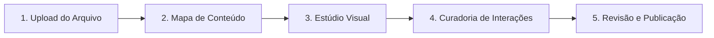

# 📘 Manual do Usuário — EduForge

Bem-vindo(a) ao **EduForge**! Nossa plataforma transforma seus PDFs, documentos e materiais didáticos em aplicativos interativos de aprendizagem (**PWAs**) em questão de minutos, prontos para uso em smartphones, tablets e computadores.

Este manual guiará você por todos os passos e recursos da plataforma, seja você um **Criador de Conteúdo**, um **Aprendiz**, ou um **Administrador**.

---

## 🧭 Índice
1. [Primeiros Passos e Segurança](#1-primeiros-passos-e-segurança)
2. [Fluxo do Criador: Criando seu App em 5 Passos](#2-fluxo-do-criador-criando-seu-app-em-5-passos)
3. [Os 9 Tipos de Interações Interativas](#3-os-9-tipos-de-interações-interativas)
4. [Recursos Avançados com Inteligência Artificial](#4-recursos-avançados-com-inteligência-artificial)
5. [Proteção de Autoria e Registro INPI](#5-proteção-de-autoria-e-registro-inpi)
6. [Experiência do Aluno (Runtime PWA)](#6-experiência-do-aluno-runtime-pwa)
7. [Analytics e Acompanhamento de Aprendizagem](#7-analytics-e-acompanhamento-de-aprendizagem)
8. [API Pública, Webhooks e Integrações](#8-api-pública-webhooks-e-integrações)

---

## 1. Primeiros Passos e Segurança

O acesso ao EduForge começa pela criação de uma conta segura.

- **Cadastro e Confirmação:** Na tela de cadastro, informe seu nome, e-mail e senha segura. Um link de confirmação será enviado para seu e-mail.
- **Autenticação em Dois Fatores (MFA / TOTP):** Proteja sua conta ativando o MFA na página de *Configurações*. Você pode utilizar qualquer aplicativo autenticador como *Google Authenticator*, *Authy* ou *1Password*. O sistema gera códigos de backup de uso único para recuperação.
- **Sessões e Privacidade LGPD:** Em *Configurações*, você pode visualizar suas sessões ativas, encerrar sessões em outros dispositivos e solicitar o download ou a exclusão/anonimização completa dos seus dados conforme a LGPD.

---

## 2. Fluxo do Criador: Criando seu App em 5 Passos

A jornada de criação no EduForge é guiada por um assistente inteligente passo a passo (*Wizard*):

### 📄 Passo 1: Upload (Ingestão de Dados)
- Envie seu material nos formatos `.pdf`, `.docx`, `.epub` ou texto estruturado em `.md`.
- A plataforma realiza a extração do texto e a classificação semântica automática utilizando modelos avançados de IA.

### 🗺️ Passo 2: Mapa de Conteúdo
- A IA organiza o material em uma árvore estruturada de **Capítulos e Seções**.
- Você pode **arrastar e soltar** para reordenar, renomear capítulos, adicionar seções ou remover tópicos irrelevantes.
- Clique em **Aprovar Mapa** para avançar.

### 🎨 Passo 3: Estúdio Visual e Acessibilidade
- **Templates de Design:** Escolha entre templates modernos com estilos e tipografias exclusivas (*Modern Clean*, *Editorial*, *Gamified Dark*, *Minimalist*).
- **Paletas de Cores:** Selecione paletas de cores verificadas com contraste **WCAG AA** para garantir total legibilidade e acessibilidade.
- **Geração de Paleta via Logotipo:** Envie a imagem da sua marca e a IA extrai automaticamente uma paleta harmoniosa com suporte a **Modo Claro e Modo Escuro**.

### 🧩 Passo 4: Curadoria de Interações
- A IA gera atividades dinâmicas calibradas de acordo com o conteúdo de cada capítulo.
- Você pode ajustar a densidade (*Baixa, Média, Alta*), regenerar interações individuais, editar enunciados e alternativas ou adicionar novas questões.
- Todo processamento de IA consome **Créditos de IA**, visíveis no topo da tela.

### 🚀 Passo 5: Revisão e Publicação
- Confira o resumo geral do app (número de capítulos, interações, tempo estimado de conclusão).
- Defina o **Modo de Acesso**:
  - 🌍 **Público:** Qualquer pessoa pode acessar e estudar.
  - 🔗 **Link Direto:** Apenas quem possui o link exclusivo.
  - 🔒 **Com Senha:** Exige uma senha definida por você no primeiro acesso.
  - ✉️ **Somente Convidados:** Exige convite por e-mail com matrícula prévia.
- Ao publicar, o app recebe um **Manifesto Imutável com Hash SHA-512 canônico**, garantindo integridade absoluta e versionamento com suporte a **Rollback**.

---

## 3. Os 9 Tipos de Interações Interativas

O EduForge conta com 9 formatos pedagógicos de interações:

1. **Múltipla Escolha (`quiz`):** Pergunta com alternativas e justificativa detalhada para a resposta correta.
2. **Flashcards com Algoritmo SM-2 (`flashcard`):** Cartões de memorização com repetição espaçada inteligente baseada no desempenho do aluno.
3. **Preenchimento de Lacunas (`cloze`):** Fixação de termos e conceitos-chave dentro do contexto.
4. **Ordenação de Processos (`ordering`):** Organização de etapas, cronologias ou passos de um procedimento.
5. **Associação de Colunas (`matching`):** Conexão entre termos e suas respectivas definições.
6. **Estudo de Caso / Cenário (`scenario`):** Situação-problema com tomada de decisão e análise de consequências.
7. **Arrastar e Soltar Categorizado (`drag_and_drop`):** Classificação visual de itens em caixas temáticas.
8. **Texto com Resposta Aberta (`open_ended`):** Questão reflexiva com avaliação por rubrica pedagógica.
9. **Verdadeiro ou Falso Justificado (`true_false`):** Julgamento de afirmações com correção comentada.

---

## 4. Recursos Avançados com Inteligência Artificial

- 🥋 **Sensei (Tutor RAG em Tempo Real):** Cada aplicativo conta com um tutor de IA contextualizado pelo conteúdo do curso. O aluno pode tirar dúvidas a qualquer momento, recebendo explicações precisas e citações diretas do texto-fonte.
- 🎙️ **Podcast Educacional Automatizado:** A IA roteiriza e sintetiza um áudio estilo podcast com **dois apresentadores** debatendo os pontos mais importantes do capítulo.
- 🖼️ **Ilustrações Vetoriais Consistentes:** Geração de diagramas e ilustrações vetoriais (SVG) que respeitam rigorosamente a paleta de cores do seu tema.
- ⚔️ **Batalhas de Conhecimento Multiplayer:** Desafios em tempo real via WebRTC onde alunos competem respondendo perguntas sobre o conteúdo do app.

---

## 5. Proteção de Autoria e Registro INPI

O EduForge é a única plataforma com suporte nativo à proteção de software e conteúdo autoral:

- **Pacote Canônico Determinístico:** Gera um arquivo ZIP contendo código-fonte, memorial descritivo gerado por IA, capturas de tela automatizadas e hash SHA-512 canônico.
- **Ficha de Registro Oficial:** Documento padronizado pronto para submissão no sistema e-Software do INPI.
- **Registro Assistido:** Nossa equipe atua como procuradora legal. Você realiza o upload da procuração assinada eletronicamente (PAdES com certificado digital ICP-Brasil ou Gov.br) e acompanhamos o protocolo, despachos na RPI e entrega do Certificado Oficial de Registro.

---

## 6. Experiência do Aluno (Runtime PWA)

O aplicativo final entregue aos alunos funciona como um **Progressive Web App (PWA)**:

- 📱 **Instalável:** Pode ser instalado diretamente na tela inicial do celular ou desktop como um app nativo, sem necessidade de download na App Store ou Google Play.
- ⚡ **Modo Offline:** O Service Worker inteligente armazena capítulos, flashcards e fontes em cache local, permitindo o estudo mesmo sem conexão à internet.
- 🏆 **Gamificação e Conquistas:** Sistema de XP, streaks diários com proteção de congelamento semanal e 8 medalhas de conquista desbloqueáveis.
- 📜 **Certificado Digital Verificável:** Ao atingir 100% de conclusão, o aluno emite automaticamente um certificado em PDF com **QR Code de autenticidade criptográfica pública**.

---

## 7. Analytics e Acompanhamento de Aprendizagem

Na aba **Analytics** de cada projeto, o criador tem acesso a:

- **Funil de Retenção e Abandono:** Percentual de conclusão por capítulo.
- **Mapa de Dificuldade (Heatmap):** Identificação de questões e seções onde os alunos apresentaram maior taxa de erro, com exportação para CSV.
- **Métricas de Engajamento:** Sessões ativas semanais, tempo médio por lição e taxa de retenção de memória no algoritmo SM-2.

---

## 8. API Pública, Webhooks e Integrações

Para instituições e criadores que desejam conectar o EduForge aos seus próprios LMS ou sistemas internos:

- **Chaves de API (`efk_live_` / `efk_test_`):** Autenticação segura via Bearer Token com permissões granulares de escopo.
- **Webhooks em Tempo Real:** Disparos assinados com HMAC-SHA256 para eventos como `learner.enrolled`, `learner.completed`, `certificate.issued` e `app.published`, com retentativas automáticas por até 24 horas.
- **Documentação OpenAPI 3.1:** Acesso à especificação completa em `/v1/openapi.json`.
